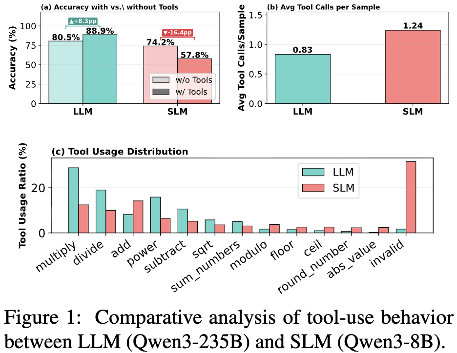
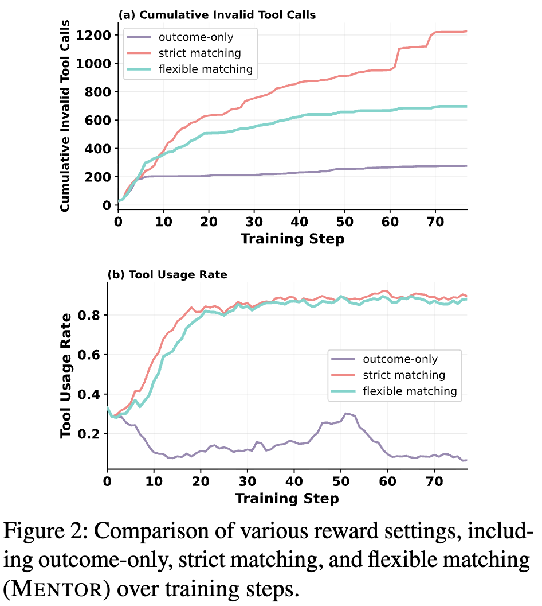
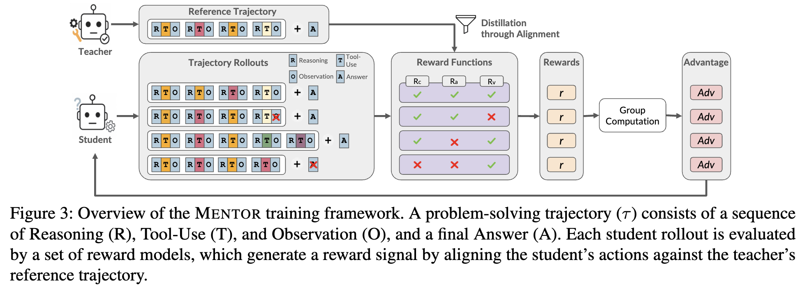
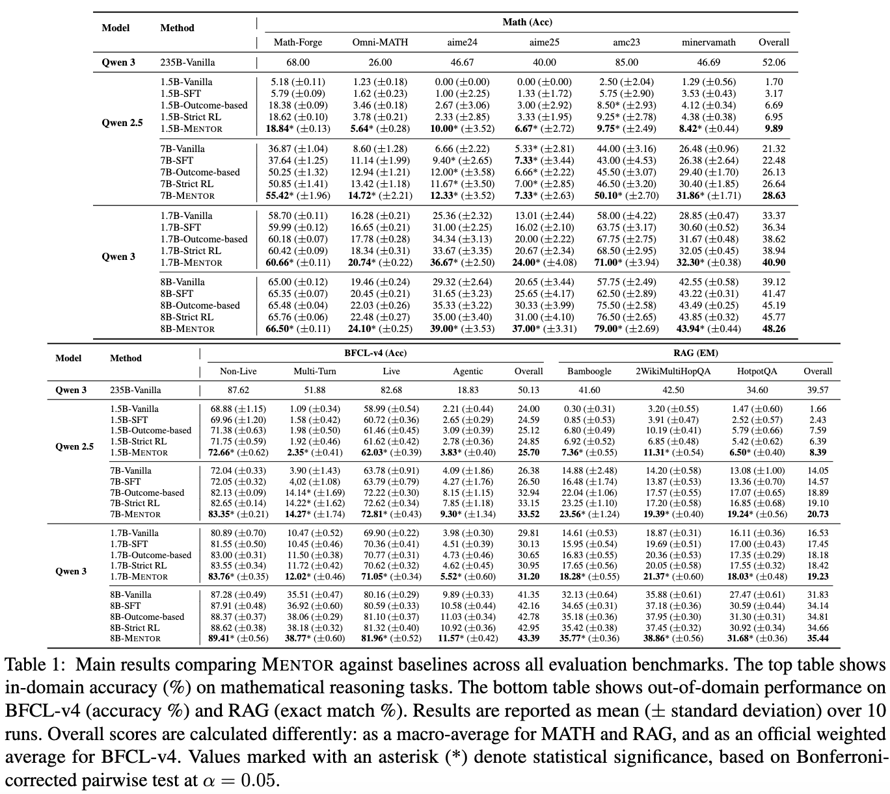
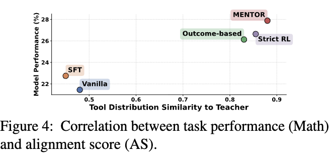
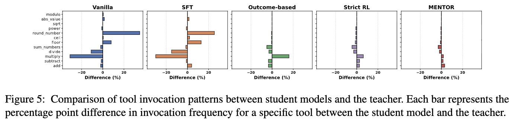
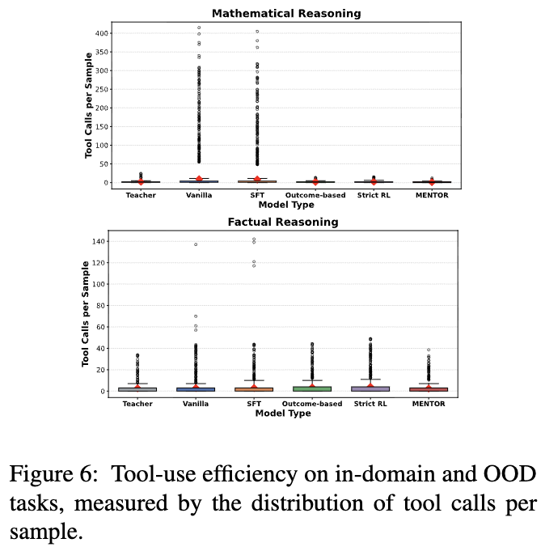
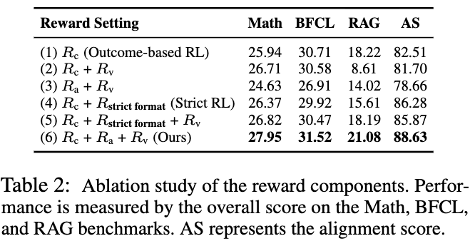
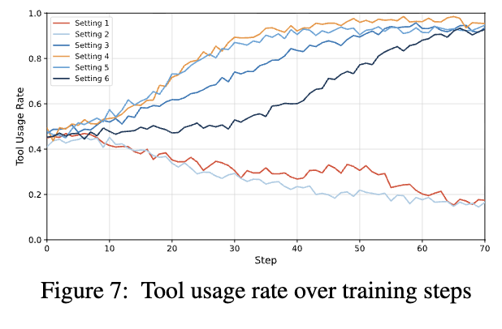
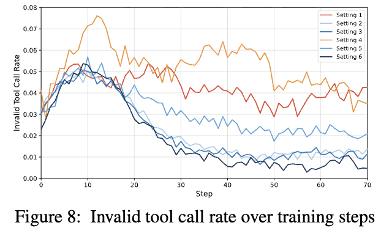

# [Agent] MENTOR: Reinforcement Learning via Flexible Teacher-Optimized Rewards for Tool-Use Distillation

- paper: https://arxiv.org/pdf/2510.18383
- github: https://github.com/choics2623/MENTOR-RL
- 저자: KAIST + Dankook University + LG CNS (ChangSu Choi, Hoyun Song 공동 1저자, ... KyungTae Lim 교신)
  - EMNLP 2026 main accepted (인용수: 0회, 26-09-17 기준)

- downstream task: Tool-Integrated Reasoning (TIR) 능력을 LLM $\to$ SLM으로 distill
  - Reasoning(R) - Tool-Use(T) - Observation(O)를 반복하다 Answer(A)를 내는 agent를 작은 모델로 옮기는 문제
- 주요 용어
  - **MENTOR**: **M**odel **E**nhancement by **N**on-rigid **T**eacher-**O**ptimized **R**ewards. teacher trajectory를 "정답 시퀀스"가 아니라 "전략적 reference"로 쓰는 on-policy distillation
  - **Reward Dilemma**: 용량이 작은 SLM은 sparse outcome reward를 주면 tool을 안 쓰는 방향(tool avoidance)으로 도망가고, strict trajectory matching을 주면 제약이 너무 세서 invalid call이 쌓임. 그 사이를 못 잡는 딜레마
  - **Teacher-Alignment Reward ($R_a$)**: 순서/포맷을 맞추라는 게 아니라, teacher가 쓴 tool "집합"과 같은 집합을 쓰면 보상. 즉 set-matching. $R_a=1 \iff \{t \mid t\in\tau^{(s)}\}=\{t\mid t\in\tau^{(t)}\}$
  - **Tool Validation Reward ($R_v$)**: student가 호출한 모든 tool이 error 없이 실행되면 보상. invalid/malformed call 억제용
  - **Alignment Score (AS)**: student와 teacher의 tool-usage 분포 간 Jensen-Shannon divergence로 만든 정렬 지표. 낮은 divergence = 높은 AS

# 1. Motivation

- LLM에 code interpreter, retrieval API 같은 external tool을 붙인 TIR agent는 강력하지만 inference 비용이 큼 $\to$ SLM으로 그 능력을 옮기고 싶음
- 기존 distillation의 두 축이 모두 SLM에서 깨짐
  - **SFT (off-policy imitation)**: teacher trajectory를 그대로 복제. static token 분포에 rigid하게 맞추다 보니 exploratory autonomy가 죽고, OOD(unseen tool) 일반화가 나쁨
  - **RL (on-policy)**: trial-and-error로 정책을 내재화할 수 있으나, SLM은 capacity가 작아 reward 설계가 딜레마에 빠짐
- **핵심 관찰 (RQ1)**: SLM(Qwen3-8B)과 LLM(Qwen3-235B)의 tool-use 행동을 비교
  - SLM이 tool을 **더 자주** 부르는데도(0.83 vs 1.24 calls/sample) success rate는 더 낮음 $\to$ 문제는 tool 참여 부족이 아니라 "효과적으로 못 쓰는 것"

    
    
    LLM vs SLM tool-use 비교: (a) tool 유무 정확도, (b) 샘플당 평균 tool call 수, (c) tool 사용 분포
  - LLM은 복잡한 연산 tool에 전략적으로 집중하는데, SLM은 단순/중복 함수에 몰리고 invalid call로 자주 실패함 $\to$ strategic planning gap
- **Reward Dilemma 실증**: reward 세팅별 학습 곡선

    
  
  reward 세팅별 cumulative invalid tool call과 tool usage rate

  - outcome-only reward: 신호가 약해 SLM이 tool을 아예 안 쓰는 쪽으로 감
  - strict trajectory matching: tool은 쓰게 되지만 rigid sequence 제약 탓에 invalid call이 계속 누적됨
  
  $\to$ (Research Question) capacity-limited SLM을 위해, uninformative outcome reward와 overly restrictive matching 사이를 잡는 **flexible, process-aware reward**를 설계하자

# 2. Contribution

- capacity-limited SLM의 fragile한 tool-use 행동을 primary bottleneck으로 실증 (RQ1) — outcome signal은 너무 약하고 trajectory matching은 너무 빡셈
- **MENTOR** 제안 (RQ2): teacher trajectory를 rigid replication 대상이 아니라 전략적 reference로 쓰는 on-policy distillation. moderated guidance로 teacher의 tool-selection 패턴을 배우되 SLM의 제한된 용량을 허용
- 여러 벤치마크에서 SFT/RL baseline 대비 **OOD tool-use 성능을 크게 올려**, 1.5B~8B 모델과 235B teacher의 격차를 좁힘 (RQ3)

# 3. Method: Flexible Reward Design (RQ2)

- 전체 구조: teacher가 문제 $x$에 대해 reference trajectory $\tau^{(t)}$와 답 $\hat y^{(t)}$를 생성. student는 GRPO로 rollout group을 만들고, 각 rollout을 teacher reference와 비교해 reward를 매김

    

    MENTOR training framework 개요: teacher reference trajectory와 student rollout을 reward function으로 정렬해 GRPO로 학습

- trajectory 정의: $O^{(t)}=(\tau^{(t)},\hat y^{(t)})$, $\tau^{(t)}=\langle (r_1,t_1,o_1),\dots\rangle$ — reasoning $r$, tool-use $t$, observation $o$의 시퀀스

- **Composite reward**: 세 요소를 가중합
  $$R(O^{(s)},O^{(t)})=w_c R_c + w_a R_a + w_v R_v$$

  - **$R_c$ (Correctness)**: student 최종 답 $\hat y^{(s)}$이 teacher 답 $\hat y^{(t)}$와 같으면 1. 단, teacher 답이 ground truth와 일치하는 reference만 사용 (robust distillation)
  - **$R_a$ (Teacher-Alignment)**: teacher가 쓴 tool 집합과 student가 쓴 tool 집합이 같으면 1. **순서/포맷은 안 봄** $\to$ 다른 순서의 valid path를 penalty 없이 탐색 가능
  - **$R_v$ (Tool Validation)**: student의 모든 tool call이 error 없이 실행되면 1. invalid/malformed call 억제

- 설계 철학: 기존 프레임워크는 tool-use를 sparse outcome-matching(ReTool 등)이나 rigid sequence-imitation(ToolRL 등)으로 봤는데, 둘 다 SLM에는 안 맞음. MENTOR는 literal sequence imitation $\to$ flexible strategic alignment로 목표를 옮김 (set-based 설계)

# 4. Experiments (RQ3)

## 4.1 Setup

- **Training domain**: mathematical reasoning (AceReason-Math). dense multi-step TIR trajectory, executable trace, 신뢰할 수 있는 correctness signal이 있어 controlled 학습에 적합
- **Teacher**: Qwen3-235B-Thinking. **Students**: Qwen3 (8B, 1.7B), Qwen2.5 (7B, 1.5B). remote sandbox에서 Python 실행
- **Baselines**: (1) Vanilla SLM, (2) SFT, (3) Outcome-based RL(outcome reward만), (4) Strict RL(ToolRL식 rigid trajectory-matching)
- **Benchmarks**: in-domain은 6개 수학 추론(Math-Forge, Omni-MATH, aime24/25, amc23, minervamath), OOD는 BFCL-v4(general tool-calling)와 RAG(retrieval QA, EM)

## 4.2 결과

전체 벤치마크 main result: 상단 Math in-domain Acc, 하단 BFCL-v4/RAG OOD

- **In-domain (Math, Overall)**: MENTOR가 모든 스케일에서 baseline 최고
  
  - Qwen3-8B: Vanilla 39.12, SFT 41.47, Outcome 45.09, Strict RL 45.77, **MENTOR 48.26**
  - Qwen3-1.7B: Vanilla 33.37 $\to$ **MENTOR 40.90** (약 +7.5pp)
  - Qwen2.5-7B: Vanilla 21.32 $\to$ **MENTOR 28.63**
- **OOD (BFCL-v4 Overall)**: SFT는 OOD에서 거의 개선 없음(static trajectory의 한계). MENTOR가 최고
  - Qwen3-8B: Vanilla 34.31, SFT 34.44, Outcome 34.51, Strict RL 32.42, **MENTOR 43.39**
  - Qwen2.5-7B: Vanilla 14.05 $\to$ **MENTOR 26.73**
- **OOD (RAG EM Overall)**: Qwen3-8B **MENTOR 35.44**로 최고 (Vanilla 34.31 대비, 타 RL baseline보다 높음)

- **Alignment이 성능과 상관** (Figure 4): student의 teacher 유사도(AS)와 downstream 정확도가 양의 상관(Pearson $r=0.85$). SFT가 정렬/성능 모두 최저, MENTOR가 정확도·정렬 모두 최고

    

    AS와 Math 성능의 상관 산점도: MENTOR가 우상단

- **Tool 사용 분포 정렬** (Figure 5): SFT는 vanilla의 기존 습관을 그대로 유지해 teacher와 편차 큼. RL baseline들은 gap을 줄이지만 여전히 편차 있음. MENTOR가 가장 tight하고 balanced

    

    student별 tool invocation 패턴과 teacher의 pp 차이 비교

- **Behavioral stability** (Figure 6): Vanilla/SFT는 redundant tool-repetition loop 등으로 outlier·분산 큼. RL은 in-domain에서 outlier를 줄임. OOD에서는 outcome/strict RL이 분산 큰데 MENTOR는 stable low variance

    
    
    in-domain/OOD의 샘플당 tool call 분포

## 4.3 Ablation (Table 2)

reward 컴포넌트 ablation: Math/BFCL/RAG 성능과 AS

- 6개 세팅 비교 (Overall AS 기준)
  - (1) $R_c$ only (Outcome-based): AS 82.51
  - (4) $R_c+R_{strict format}$ (Strict RL): AS 86.28
  - (6) $R_c+R_a+R_v$ (**MENTOR**): Math 27.95 / BFCL 31.52 / RAG 21.08 / **AS 88.63** — 전부 최고
  
- **flexible vs strict**: *Strict RL(4,5)은 AS는 높지만 OOD에서 diminishing return*. MENTOR는 rigid rule을 flexible guidance로 대체해 정렬·일반화 모두 최고

- **teacher guidance 효과** (Figure 7): teacher alignment 없는 세팅(1,2)은 tool-avoidant로 drift. strict(4,5)는 즉각적이지만 rigid한 사용. MENTOR(6)는 느리게 시작하지만 stable하게 high usage로 수렴

    

- **$R_v$ 효과** (Figure 8): $R_v$ 없는 세팅(1,4)은 invalid call 억제 실패. $R_v$ 넣은 세팅(2,3,5,6)은 invalid call이 near-zero로 빠르게 수렴 $\to$ invalid call 직접 penalize가 reliable agent에 효과적

    

    

# 5. Conclusion & Limitations

- **결론**: SLM에 tool-use를 distill할 때 rigid replication보다, **operational boundary 안에서 배울 flexibility를 주는 것**이 더 효과적. MENTOR가 OOD tool-use를 일관되게 개선하며 strategic alignment와 downstream 성능을 동시에 잡음
- **Limitations** (저자 명시)
  - **다른 모델로의 확장**: 실험이 Qwen(2.5/3) 계열 중심. instruction tuning으로 이미 executable tool-use 초기 능력이 있는 모델을 전제로 함. 초기 TIR(Tool Integrated Reasoning) 능력이 없는 모델은 짧은 SFT warm-up으로 tool-use 포맷을 grounding한 뒤 RL하는 게 자연스러움 (이 warm-up은 MENTOR 한정이 아니라 모든 RL 방법에 공통)
  - **real-world interactive 환경 아님**: sandbox의 executable-tool 세팅으로 reward 설계 효과를 isolate한 것. web browser, simulator, multi-API 같은 open-ended 환경의 interface grounding·noisy observation·long-horizon state·safety는 범위 밖
  - **teacher trajectory = distillation reference**: globally optimal policy는 아님. 정답 일치 case만 필터링하지만 correct trajectory도 효율/순서/최소 tool 측면에서 suboptimal일 수 있음. ground-truth 기반 직접 최적화는 future work
  - **reward weight search 비용**: $w_c,w_a,w_v$ full grid search는 매번 전체 RL 학습이 필요해 비쌈. dev-set diagnostic으로 선택했고 체계적 최적화는 future work
- **Ethical**: distill된 agent가 autonomous reasoning·web retrieval·code execution이 가능해 harmful script 생성, unauthorized action, misinformation 확산에 악용될 여지 $\to$ robust safeguard 필요

# Takeaways

- SLM tool-use의 병목은 "tool을 덜 쓰는 것"이 아니라 "효과적으로 못 쓰는 것" — 진단(Figure 1)이 명확하고 reward 설계가 그 진단에서 바로 도출됨
- 핵심 아이디어는 **set-based teacher alignment($R_a$)**: 순서·포맷을 강제하지 않고 tool "집합"만 맞추게 해 flexibility와 guidance를 동시에 확보. rigid ToolRL식 matching보다 특히 OOD에서 우위
- $R_v$(tool validation)가 invalid call을 near-zero로 눌러주는 게 실전 신뢰도에 직접 기여 — reward 컴포넌트별 역할 분리가 깔끔함
- 다만 SFT-free RL은 초기 TIR 능력이 있는 backbone 전제, sandbox 한정 검증이라는 scope 제약은 감안해야 함
