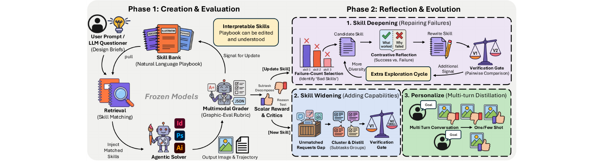
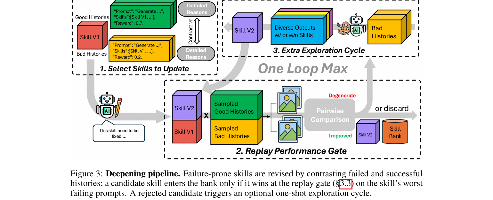
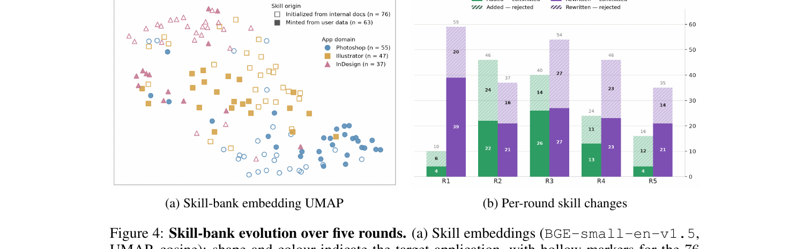
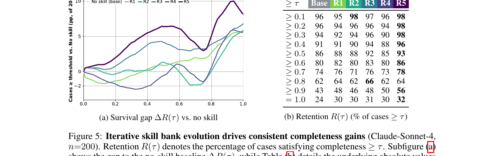
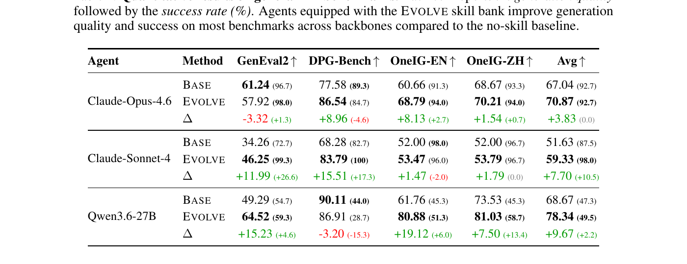
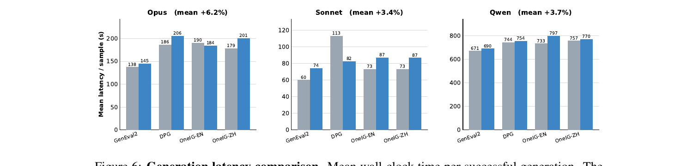
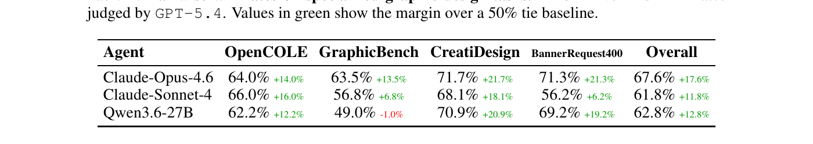
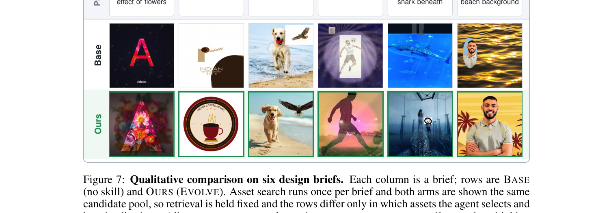
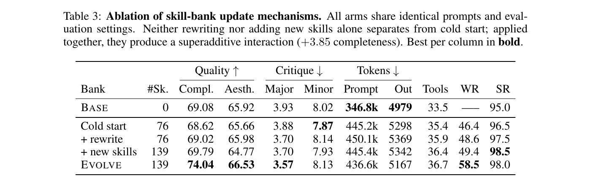

# [Agent] Evolving Procedural Memory from User Traffic for Agentic Graphic Design

- paper: https://arxiv.org/abs/2609.22086
- 저자: Hongyang Du (Adobe, Brown Univ.), Lan Yan, Christian Flores, Asim Kadav (Adobe)
- 게재: arXiv preprint, '26-09-18 (cs.AI / cs.CV)
- downstream task: Agentic Graphic Design — frozen LLM이 Photoshop/Illustrator/InDesign 상당(230+ tools)을 조작해 편집 가능한(editable) 디자인 아티팩트를 생성/편집
  - 예시 brief: "Create Adobe logo with double exposure effect of flowers", "Make a logo for Indian Coffee House"
- 주요 용어
  - **procedural memory (skill bank)**: 모델 weight 밖에 존재하는, 자연어로 기술된 재사용 가능한 디자인 절차들의 외부 라이브러리 (`SKILL.md` 파일들). weight 대신 이 라이브러리만 학습됨
  - **skill(procedure)**: 원자적 tool 호출 하나와 전체 trajectory 사이에 위치하는 절차. 실행을 안내할 만큼 구체적이면서 전이(transfer)될 만큼 일반적임. 고정 시퀀스가 아니라 모델이 재배열/부분적용 가능한 자연어 가이드
  - **widening (넓히기)**: user traffic에서 반복적으로 커버되지 않는 subtask를 발견해 새 skill로 distill $\to$ coverage 확장
  - **deepening (깊게하기)**: 기존 skill을 그 skill 자신의 성공/실패 이력을 대조(contrast)해 개정(rewrite) $\to$ 실패 복구
  - **matched replay gate**: 제안된 변경이 배포 bank에 들어갈지 결정하는 보수적 관문. 관측된 성공을 regress시키지 않으면서 실패만 복구하는 변경만 허용

# 1. Motivation

- 전문 그래픽 디자인은 **long-horizon agentic task**: 구조화된 편집 가능 아티팩트가 수십 개의 상호의존적 action에서 생성됨
  - 하지만 코드와 달리 **실행 가능한 success oracle(정답 검증기)이 없음**. brief는 구체적 요구(text, color, placement)와 주관적 기준(hierarchy, composition, style)이 섞임
- User traffic으로부터 학습하기 어려운 이유
  1. 단일 request가 수십 개 상호의존 operation을 요구 $\to$ terminal feedback이 어느 결정이 성공/실패를 유발했는지 약하게만 식별 (credit assignment 문제)
  2. Outcome 검증이 어려움 (LLM 평가자는 position/order bias 존재)
  3. Foundation model이 외부 호스팅되거나 업데이트가 비현실적인 경우가 많음
- $\to$ Supervised learning은 값비싼 demonstration이 필요하고, outcome 기반 optimization은 long-horizon credit assignment와 불완전한 proxy reward를 모두 감당해야 함
- **핵심 아이디어**: 모델 weight는 frozen으로 두고, 그 **주변의 procedural memory를 parameter update 없이 진화**시키자. noisy하고 unverifiable한 feedback 아래에서 agent를 continual adaptation하는 실용적 경로

# 2. Contribution

- **Skill evolution in a professional graphic-design agent** (§3): frozen foundation model 주변의 재사용 가능한 절차 라이브러리 자체를 학습 대상으로 삼음. user traffic에서 절차를 acquire(widening)하고 revise(deepening)
- **Conservative evolution under unverifiable feedback** (§3.3): noisy judge/rollout feedback 아래에서 어떤 변경이 배포 bank에 들어갈지 통제하는 **matched replay gate** 도입
- **Coupled acquisition and revision in deployment** (§4): 5 라운드, 여러 frozen backbone, 여러 벤치마크에 걸쳐 acquisition과 revision이 각각 단독보다 **결합했을 때 훨씬 효과적**임을 보임 (superadditive)

# 3. Evolving Loop

*Figure 1. System overview: 왼쪽 rollout & reward, 오른쪽 reflection & evolution*

- 모델 weight는 그대로 두고 offline loop로 skill bank만 진화. 네 개 role로 구성:

| Role | 역할 |
|---|---|
| **Prompter** | user data와 LLM으로 design brief 생성 |
| **Solver** | agent 자체: skill bank + tools $\to$ 렌더된 이미지 |
| **Grader** | multimodal; 각 이미지를 채점하고 unmet requirement 이유 설명 |
| **Reflector** | 실패를 `SKILL.md`의 targeted edit으로 변환 |

- **Skill-bank interface**: skill 없이도 agent는 full tool catalog에서 workflow를 재구성함. skill retrieval을 끄면 원래 agent로 환원 $\to$ evolving bank의 개선분을 측정하는 자연스러운 control
- bank는 두 축으로 변화: **widening**(§3.1) / **deepening**(§3.2). Personalize(multi-turn distillation)는 Appendix I로 분리, 본문 실험에서 제외

## 3.1 Widening: 새 skill 발굴

*Figure 2. Widening pipeline: cluster → distill → replay gate*

- 각 trajectory에서 frozen LLM이 실제 수행된 subtask를 추출·정규화
- **uncovered** 판정: retrieval이 아무것도 반환하지 않거나, 반환된 skill이 task의 다른 부분만 커버하거나, 나쁜 결과로 blame된 skill과 연관된 경우
- uncovered subtask는 canonical label로 keyed된 **persistent coverage gap pool**에 누적. 어떤 label이 $k_{\min}=3$회 도달하면 frozen LLM이 candidate skill로 distill
- candidate는 replay gate(§3.3)를 no-skill baseline 대비 통과해야만 admit. rejected여도 그 발생 이력은 pool에 남아 라운드 간 증거 축적

## 3.2 Deepening: 기존 skill 강화

*Figure 3. Deepening pipeline: 성공/실패 이력 대조 → replay gate → 채택/기각*

- **비대칭 설계**: selection은 값싸고 관대한 heuristic, gate(heuristic이 아님)가 실제 무엇이 ship될지 결정
- 각 trajectory는 어느 skill을 retrieve했는지 기록. success threshold 미만($s_j < \tau$, $\tau=0.6$) trajectory는 retrieve한 모든 skill에 대해 실패로 카운트
- failure-count가 threshold $m$(default 2)에 도달한 skill을 most-failing부터 revision 선택
- Reflector는 brief, per-requirement outcome, "why-bad" rationale, 현재 `SKILL.md`, 그리고 **같은 skill의 성공 호출 contrastive set**을 받음
  - 성공 run = do-not-regress baseline, 실패 rationale = 개선 지점 $\to$ 성공↔실패 divergence로 추론
  - targeted edit 발행; 반복적으로 gate 실패 시 whole skill의 major rewrite로 escalate
  - rejected rewrite는 optional exploration cycle 트리거 (skill 有/無로 failing prompt 탐색 후 이긴 쪽으로 distill)

## 3.3 Replay Gate

- 두 축 모두 변경을 제안하지만, **단일 gate가 무엇을 ship할지 결정**. 두 confounding 원천을 해결:
  1. VLM Grader의 절대 점수는 run마다 drift $\to$ "평균 점수 오르면 채택"은 개선과 regression을 혼동. **gate는 절대 점수를 절대 사용하지 않음**
  2. Outcome은 skill 외 요인(asset retrieval 등 upstream state)에도 의존 $\to$ candidate가 단지 더 나은 입력을 받아서 이길 수 있음
- 해결: skill을 exercise하는 prompt를 sampling, prompt당 여러 context 생성(각기 다른 retrieved asset/upstream state). 각 context를 freeze 후 **동일 batch에서 두 arm(candidate vs incumbent, 또는 candidate vs no-skill)을 pairwise 비교**. context 내 유일한 차이는 skill 조건
- prompt는 자신의 context 다수를 이겨야 승리 (한 context의 큰 이득이 다른 loss를 가리지 못하게)
- 변경 ship 조건 (식 1):

$$(\nexists\ \text{prompt lost}) \wedge (\exists\ \text{prompt won})$$

*Figure 4. Skill-bank evolution over five rounds: (a) UMAP 임베딩, (b) 라운드별 skill 변화*

# 4. Experiments

## Setup

- **Base(no-skill)** 대비 **Evolve** 비교, underlying agent는 고정
- Backbone 3종: `claude-opus-4.6`, `claude-sonnet-4` (Amazon Bedrock), `Qwen3.6-27B` (vLLM, 8×A100, 65K token)
  - Claude는 low thinking effort (Opus 2,000 / Sonnet 5,000 token cap), 모든 backbone prompt당 900s wall-clock cap
- **Internal benchmark**: 각 라운드 ≈300 brief(user traffic + LLM 증강)로 graded trajectory 생성 $\to$ widening/deepening 구동. 평가는 별도 held-out 200 human-authored brief(5라운드 고정)
- **External benchmark** (각 300 prompt sampling):
  - General T2I: **GenEval2**, **DPG-Bench**, **OneIG-EN/OneIG-ZH** (Soft-TIFA, VQAScore 등으로 report)
  - Design: **OpenCOLE**, **GraphicBench**, **CreatiDesign**, **BannerRequest400** — `GPT-5.4`가 blind 2-order pairwise로 Evolve-vs-Base win rate 판정

## 5 라운드 진화 요약

- 1,406 non-overlapping brief로 5 라운드 $\to$ 1,869 graded trajectory (human label 無, weight update 無)
- **bank: 76 (문서 기반 cold start) $\to$ 139 skills**
- R1은 repair 위주(59 rewrite 중 39, mint 10 중 4 통과), widening은 $k_{\min}$ 누적 필요로 지연 $\to$ R2–R3에서 minting 정점(22/40, 26/40 committed), R5는 rewrite 21 + mint 4로 반전되며 전 threshold에서 최강 라운드
- 5 라운드 net: gate가 rewrite 131/231, mint 69/136 채택. net 성장(63)은 gross mint보다 작음 (deepening이 superseded skill discard)
- minted skill의 nearest-neighbor 거리가 cold-start bank의 내부 간격 초과 (0.215 vs 0.158) $\to$ widening이 seed를 paraphrase하는 게 아니라 놓친 intent를 커버함

*Figure 5. Iterative skill bank evolution이 completeness gain을 견인: (a) survival gap, (b) retention table*

- 내부 벤치마크(sonnet-4, held-out 200): R5가 거의 모든 completeness threshold에서 개선. $\ge 0.5$: 86% $\to$ 93%, $\ge 0.9$: 43% $\to$ 56%, $=1.0$(완벽): 24% $\to$ 32% (+8pp), 최대 survival gap은 $\tau\ge0.9$에서 +13pp
- 단, monotonic 아님: R4는 completeness $\ge0.3$에서 no-skill 하회(90% vs 94%). R4가 최다 미개정 v1 skill 보유 $\to$ minted skill이 origin cluster 밖에서 misfire

## Main Results — General T2I (Table 1)

*Table 1. General T2I 벤치마크 정량 결과: quality (success rate %)*

- 각 cell: generation quality (success rate %). Δ는 Evolve − Base:

| Backbone | 지표 | GenEval2 | DPG-Bench | OneIG-EN | OneIG-ZH | Avg |
|---|---|---|---|---|---|---|
| Opus-4.6 | Δ quality | -3.32 | **+8.96** | **+8.13** | +1.54 | +3.83 |
| Sonnet-4 | Δ quality | **+11.99** | **+15.51** | +1.47 | +1.79 | +7.70 |
| Qwen3.6-27B | Δ quality | +15.23 | -3.20 | **+19.12** | +7.50 | +9.67 |

- **Sonnet-4**에서 효과 최대: GenEval2 success rate **72.7% $\to$ 99.3%** (+26.6pp), DPG-Bench **82.7% $\to$ 100%**
- Quality는 대부분 backbone·벤치마크에서 상승하나 일부 regress (Opus GenEval2, Qwen DPG). Qwen의 높은 절대 quality는 낮은 success rate와 함께 해석해야 함 (성공 출력에서만 평가되어 easy prompt에 편향)
- **Latency overhead 3.4%~6.2%**로 modest, 때로 오히려 단축 (Sonnet DPG-Bench 113s $\to$ 82s)

*Figure 6. Generation latency comparison: 성공 생성당 평균 wall-clock*

## Main Results — Design Tasks (Table 2)

*Table 2. Specialized graphic design task pairwise win rate*

- Evolve-vs-Base win rate (GPT-5.4 판정, 50% tie baseline 대비 margin):

| Backbone | OpenCOLE | GraphicBench | CreatiDesign | BannerRequest400 | Overall |
|---|---|---|---|---|---|
| Opus-4.6 | 64.0% | 63.5% | 71.7% | 71.3% | **67.6%** |
| Sonnet-4 | 66.0% | 56.8% | 68.1% | 56.2% | **61.8%** |
| Qwen3.6-27B | 62.2% | 49.0% | 70.9% | 69.2% | **62.8%** |

- 전 backbone에서 Base를 능가. Opus는 67.6% overall(CreatiDesign 71.7% 정점). margin은 복잡한 multi-step design constraint 해결에서 특히 큼
- 유일한 예외: Qwen × GraphicBench 49.0% (-1.0%)

*Figure 7. 6개 design brief 정성 비교: Base vs Ours 행*

- **Editing**: Evolve는 multi-step 편집 절차(double exposure: subject 추출 → mask → blend)를 끝까지 수행, Base는 중도 포기. 실패 양상이 다름 — Base는 절차를 시작조차 안 함 $\to$ 능력 부재가 아니라 **절차 부재**임을 시사
- **Asset selection**: Evolve는 downstream 편집을 염두에 두고 asset 선택 (예: whale shark를 아래 배치할 glass tunnel 선택), Base는 brief 명사에 표면 매칭

# 5. Ablation Study (Table 3)

*Table 3. skill-bank update mechanism ablation*

- 200 unseen prompt, 동일 agent/prompt. Deepening(+rewrite)과 Widening(+new skills)을 격리:

| Bank | #Sk. | Compl.↑ | Aesth.↑ | WR | SR |
|---|---|---|---|---|---|
| BASE | 0 | 69.08 | 65.92 | — | 95.0 |
| Cold start | 76 | 68.62 | 65.66 | 46.4 | 96.5 |
| + rewrite | 76 | 69.02 | 65.98 | 48.6 | 97.5 |
| + new skills | 139 | 69.79 | 64.77 | 49.4 | **98.5** |
| **EVOLVE** | 139 | **74.04** | **66.53** | **58.5** | 98.0 |

- **핵심**: 문서 기반 cold start는 Base를 개선 못함(68.62 vs 69.08). rewrite 단독(69.02, WR 48.6%)·widening 단독(69.79, WR 49.4%) 모두 불충분
- 결합 시 completeness **74.04**, WR **58.5%** ($p=0.025$) $\to$ superadditive gain (+3.85 completeness). loop coupling 효과: minted skill은 refined retrieval description 필요, rewrite는 unfixable failure를 minting용 gap store로 재라우팅
- Gain은 completeness에 집중, aesthetics(65.92→66.53)·critique는 거의 불변
- Skill retrieval이 Base 대비 ~28% prompt token 추가하나, evolution은 top-$k$($k=3$) matching에서 marginal token cost 없음. 오히려 Evolve가 cold start보다 적은 token 사용 (더 직접적 실행, 적은 corrective retry)

# 6. Conclusion & Limitations

- **요약**: procedural memory(자연어 skill의 외부 라이브러리)를 weight update·human label 없이 5 라운드로 76 $\to$ 139 skill 진화. widening/deepening은 단독으로 불충분하지만 결합 시 held-out에서 명확한 gain
- **저자가 밝힌 한계**:
  - 자연어 skill이 선호 절차를 기술해도, 모델이 강한 default strategy를 가질 때 **retrieval만으로는 모델이 그 절차를 따르게 만들지 못함**
  - Fine geometric operation은 model perception·automated verification의 한계로 여전히 제약. 긴 절차는 instruction이 실행 step에 걸쳐 누적되며 fidelity 손실
  - Replay gate는 평가된 case에 local $\to$ 관측된 regression은 막지만 전체 user-traffic 분포에서 monotonic 개선을 보장하지 않음 (R4 사례)
  - $\to$ 향후: preference-aware retrieval, deterministic primitive, structured plan, 더 정밀한 verification 필요
- Procedural memory는 continual adaptation의 **한 메커니즘**이지, 자연어 가이드로 유도 불가능한 능력이 필요한 task에서 model learning이나 structured execution을 대체하지 않음

# Takeaways

- **Frozen model + evolving external memory**: weight를 못 건드리는(외부 호스팅) frontier model 환경에서 continual adaptation의 현실적 레시피. 학습 대상을 파라미터가 아닌 자연어 skill 라이브러리로 옮김
- **Unverifiable feedback의 핵심은 gate 설계**: 절대 점수(drift) 대신 matched context pairwise replay로 "regression 없이 실패만 복구" 조건을 강제한 것이 noisy judge 아래 진화를 가능케 한 열쇠
- **Widening × Deepening의 superadditivity**: coverage 확장(mint)과 reliability 전환(rewrite)은 서로의 재료를 공급 — 단독 도입 시 거의 무효(+0.7pp WR 미만), 결합 시 +12pp
- **적용 관점**: 우리 서비스의 agentic workflow(디자인/툴 조작 등)에도, 실행 trajectory를 로그로 쌓아 반복 실패 subtask를 자연어 절차로 distill하고 replay gate로 검증하는 구조가 이식 가능. 단 "모델이 절차를 무시하는" 한계와 monotonic 보장 부재는 염두에 둘 것
