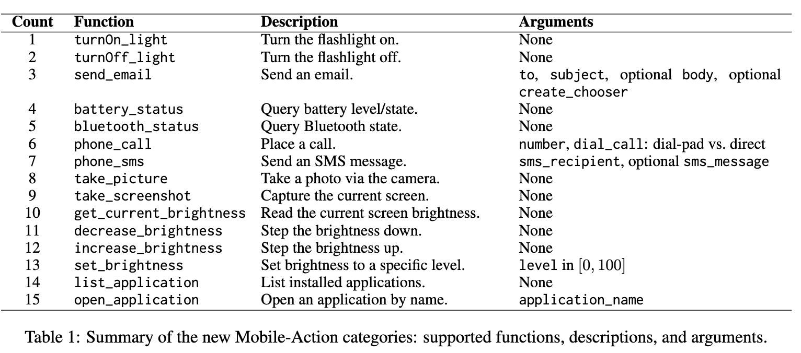
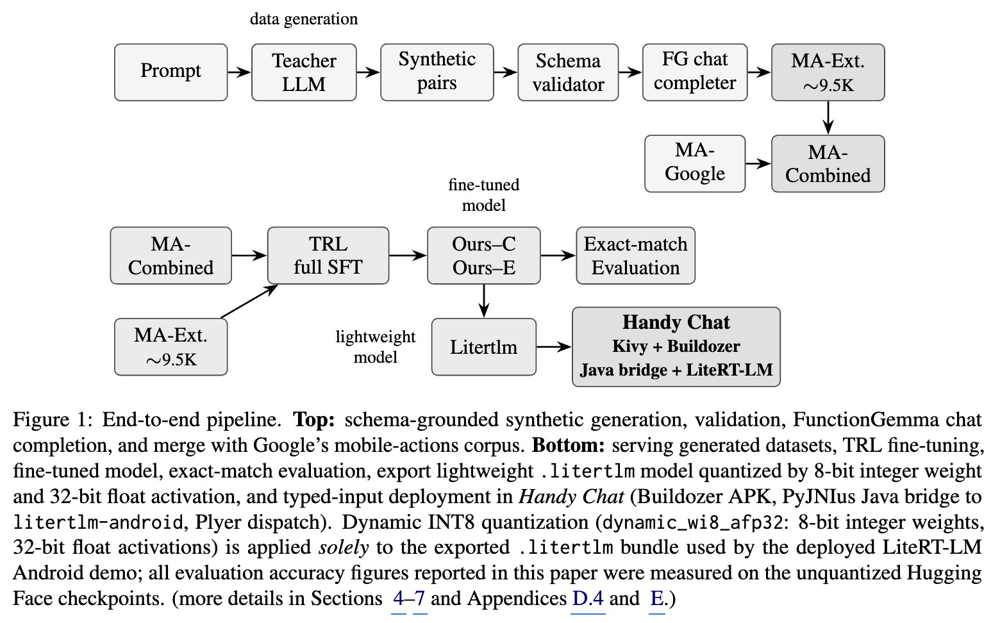
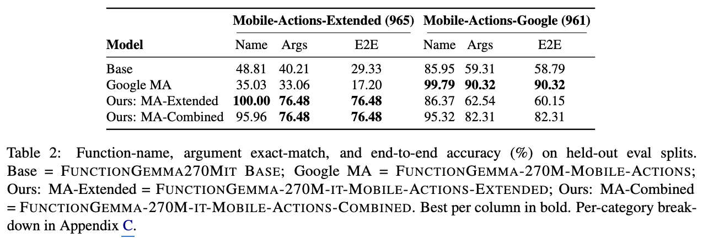
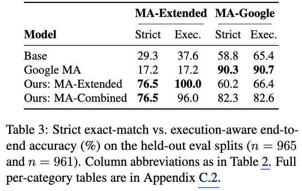

# [Agent] Extending FunctionGemma for Practical On-Device Mobile Function Calling

- paper: https://arxiv.org/pdf/2609.25373
- models: FunctionGemma-270M-it-Mobile-Actions-Extended / -Combined (HuggingFace 공개)
- base: google/functiongemma-270m-it (Gemma 3 270M 계열)
- EMNLP 2026 accpeted (인용수: 0회, 26-09-28 기준) 
- 저자: Ali Rezagholizadeh (UGrowAI), Soheila Samiee
- downstream task: On-Device Mobile Function Calling (자연어 $\to$ 안드로이드 시스템 액션 tool call)
  - ex. "check battery and take a screenshot" $\to$ `battery_status()`, `take_screenshot()`
- 주요 용어
  - **system action vs web API**: 서버측 agent는 REST/검색/캘린더 같은 web API를 부름. 반면 온디바이스 assistant는 flashlight, SMS, battery 조회처럼 OS를 거쳐야 하는 system action을 부름 — 고빈도·저지연·프라이버시 민감.
  - **MobileActionsExtended**: 저자들이 만든 ~9,500개 합성 function-calling 데이터셋. 15개 device-control 카테고리 (기존 Google Mobile Actions의 7개보다 넓음).
  - **completion-only loss**: TRL SFT에서 prompt(system/developer/user turn)에는 loss를 마스킹하고 assistant 생성분만 학습. tool catalog가 길어 prompt가 대부분을 차지할 때 학습 안정화.
  - **execution-aware accuracy**: strict exact-match 대신, 런타임이 안전하게 채울 수 있는 optional boolean(ex. `dial_call`, `create_chooser`) 누락은 정답으로 인정하는 재채점 기준.
  - **coverage vs specialization trade-off**: 좁은 분포에 fine-tune하면 그 분포는 강해지지만 확장 카테고리에서 기존 prior가 오작동. 두 데이터셋을 합쳐 학습하면 완화됨.

# 1. Motivation

- function calling은 이제 표준: 모델이 free-form text 대신 `<name, args>` 구조화 호출을 뱉으면 런타임이 OS API·web service·로컬 HW로 dispatch.
- 그런데 대부분의 공개 벤치마크(BFCL, BigCodeBench, APIGen)와 데이터는 **web API**에 치우쳐 있음.
- 온디바이스 assistant는 반대로 **system action** 위주: flashlight 켜기, SMS 보내기, 앱 열기, battery 조회 등. 이건 고빈도이고 지연·프라이버시에 민감해서 **작은 로컬 모델**이 필요함.
- sub-billion 모델인 FunctionGemma 270M-it이 이 자리를 노리지만, 이미 나온 특화 버전(FunctionGemma 270M Mobile Actions)은 **7개 워크플로우**(calendar event, contact, map, email, wifi, flashlight)만 커버. phone call, SMS, brightness, camera, screenshot, app open 같은 일상 intent가 빠져 있음.
- 핵심 질문 3개:
  - **(Q1) Coverage gap**: 공개 FunctionGemma는 학습 분포 밖 모바일 액션을 얼마나 처리하나?
  - **(Q2) Targeted fine-tuning**: 합성 스키마 검증 데이터로 full SFT하면 15개 카테고리 gap을 270M 백본에서 메울 수 있나?
  - **(Q3) Cross-domain transfer**: 한 모델이 기존(Google Mobile Actions) + 신규(device action) 분포를 동시에 서빙할 수 있나?

# 2. Contribution

- **(i) 오픈 모바일 액션 데이터셋**: MobileActionsExtended, ~9,500개. 스키마 기반 합성 생성 후 tool-call 유효성 사후 검증, train/eval 90/10 split.
- **(ii) 두 개의 fine-tuned 모델**: TRL completion-only loss로 학습한 `...-Mobile-Actions-Extended`(확장분만)와 `...-Mobile-Actions-Combined`(Google 데이터와 합쳐 학습).
- **(iii) multi-axis 평가**: 4개 모델 × 2개 held-out split × 3개 지표(function-name / argument / end-to-end exact match).
- **(iv) end-to-end 파이프라인**: 데이터 생성 → TRL fine-tuning → 평가를 3개 독립 패키지로 오픈소스.
- **(v) 온디바이스 데모 앱 (Handy Chat)**: `.litertlm`로 export한 확장 모델을 Buildozer 패키징 안드로이드 앱에 탑재, LiteRT-LM CPU 백엔드로 로컬 추론.

# 3. Task Definition & Tool Catalog

- 표준 formulation: tool catalog $\mathcal{T} = \{T_1, \dots, T_K\}$ (각 $T_k$는 name·설명·파라미터 스키마), user utterance $u$가 주어지면 모델은 순서 있는 호출열 $\hat{c}_1, \dots, \hat{c}_m$을 생성. 각 $\hat{c}_i = \langle \text{name}_i, \text{args}_i \rangle$.
- FunctionGemma는 sentinel token(`<start_function_call>`, `<end_function_call>`, `<escape>`)으로 호출을 렌더링 $\to$ 결정론적 파싱 가능.
- 평가 granularity 3단계 (Patil et al. 2025 따름):
  - **function-name accuracy**: 순서 있는 name 리스트 exact match
  - **argument exact match**: key-정렬한 argument dict exact match
  - **end-to-end correctness**: 위 둘의 논리 AND (extra/missing key 하나라도 있으면 실패 — strict)

- 신규 15개 Mobile-Action 카테고리: turnOn/Off_light, send_email, battery_status, bluetooth_status, phone_call, phone_sms, take_picture, take_screenshot, brightness 계열, list/open_application 등과 각 argument)

- 15개 카테고리는 Plyer(cross-platform 안드로이드 API) 스타일 스키마를 미러링해서 데모 런타임의 실제 handler로 dispatch 가능하도록 설계.

# 4. Dataset Construction: MobileActionsExtended

## 4.1 Schema-Grounded Synthetic Generation

- 강한 teacher LLM에 JSON tool 리스트 + 예시 출력을 주고 생성. (i) 단일 tool당 ~300 prompt, (ii) ~5,000개 multi-tool prompt (ex. "check battery and take a screenshot"). 각 레코드는 user/assistant 쌍.
  - APIGen·ToolACE 레시피를 따르되, **생성 중 호출을 실제 실행하진 않고** 구조 검증에 의존.

## 4.2 Validation & Completion

- validator(`validate_generated_dataset.py`)가 모든 assistant 메시지 파싱해서: (i) 호출된 함수명이 catalog에 있는지, (ii) required argument가 전부 있고 타입 맞는지, (iii) argument 값이 스키마 primitive 타입(STRING/BOOLEAN/NUMBER)과 일치하는지 확인. 실패는 drop 또는 `json_repair`로 수리.
- completion script(`complete_dataset.py`)가 FunctionGemma가 요구하는 필드(metadata, tools 선언, messages) 추가. developer role에 현재 날짜/시간과 함수 선언을 sentinel token으로 주입.

## 4.3 Merging & Statistics

- MobileActionsCombined = MobileActionsExtended ∪ Google Mobile Actions. 스키마가 동일해 필드 수술 불필요, per-source train/eval flag 보존.
- MobileActionsExtended: ~9,500 레코드, eval split 965개(15개 카테고리). 최대 카테고리는 `open_application`(209), `phone_sms`(114). 약 1/3이 multi-call. 비교군 Google Mobile Actions는 eval 961개(7개 카테고리).

- end-to-end 파이프라인: 합성 생성→검증→FG chat completion→Google 데이터 병합 / TRL full SFT→exact-match 평가 / litertlm export→Handy Chat

# 5. Model & Training

- FunctionGemma 270M-it을 HF Transformers + TRL SFTTrainer로 **full SFT**(PEFT/LoRA 없음), 2 epoch, lr $1 \times 10^{-5}$, cosine+warmup, effective batch 32(4/device × 8 grad accum), bf16, gradient checkpointing.
- 270M 백본은 단일 accelerator(CUDA or Apple Silicon MPS)에 충분 $\to$ LoRA 없이 weight 전체 교체, inference 시 adapter merge 없음.
- **completion-only loss**(`completion_only_loss=true`)로 prompt 마스킹 후 assistant 생성분만 채점. tool catalog만 수백 토큰이라 prompt가 지배적일 때 안정화에 중요.
- 두 모델을 동일 세팅으로 학습: `-Extended`(확장분만, Q1/Q2 겨냥)와 `-Combined`(병합, Q3 겨냥).
- inference는 greedy(`do_sample=False`, temp=0, max_new_tokens=1024), regex decoder 파싱. schema-constrained decoding은 **안 씀** $\to$ 보고된 수치는 unconstrained 생성 행동.

# 6. Experiments

## 6.1 Main Results

 (Mobile-Actions-Extended 965 / Mobile-Actions-Google 961에서 Name·Args·E2E exact-match, 4개 모델 비교)

- **Coverage gap (Q1)**: base는 확장 분포에서 29.3%. Google-특화 버전은 오히려 **17.2%**로 더 낮음 — 7개 카테고리에 fine-tune한 게 15개 확장 카테고리를 적극적으로 해침 (in-distribution 호출 ex. `open_wifi_settings`를 자신 있게 잘못 뱉음).
- **Targeted fine-tuning (Q2)**: `-Extended`는 function-name accuracy 100%, E2E 76.5% — base 대비 **+47.2pp**. 남은 23.5%는 대부분 optional boolean 같은 argument-level 오류.
- **Cross-domain transfer (Q3)**: `-Combined`는 확장에서 76.5% 유지하면서 Google에서 82.3% — Google 전용 특화 대비 **~8pp만 손해**. 확장분만 학습하면 Google에서 60.2%에 그침 $\to$ **merge step이 관건**.

## 6.3 Execution-Aware Accuracy

- strict exact-match는 런타임이 복구 가능한 누락까지 실패로 처리해 배포 품질을 과소평가. `phone_call.dial_call`, `send_email.create_chooser` 같은 짧은 safe-default boolean(런타임이 false로 채움) 누락은 정답으로 재채점 (단, 스키마 밖 hallucinated key는 여전히 실패).

 (Strict vs Execution-aware E2E: MA-Extended / MA-Google)

- `-Extended`의 execution-aware가 76.5% $\to$ **100.0%**: 남은 strict 오류가 전부 복구 가능한 포맷 이슈였음을 의미 (tool 선택 오류가 아님).
- base·Google 모델은 OOD 데이터에서 exec-aware로 거의 안 오름(+8.3, +0.0) $\to$ 이들의 실패는 진짜 tool-selection 오류.

## 6.4 Error Analysis

- fine-tuned 모델은 모든 확장 카테고리에서 function-name accuracy 100%. 주요 오류 유형:
  1. **optional-boolean 누락**: `phone_call`/`send_email`의 routing boolean(`dial_call`, `create_chooser`) 생략 — 실행 액션은 여전히 정답.
  2. **free-text argument noise**: `phone_sms`·Google `show_map`에서 전화번호 정규화나 위치 문자열 rephrase.
  3. **multi-call ordering**: 소수 multi-call 예제에서 호출 순서 뒤집힘.
- 셋 다 백본의 구조적 function-call 능력 문제가 아니라 데이터셋 신호 품질 이슈. 간단한 post-processing으로 E2E를 76.5% $\to$ ~84%까지 올릴 수 있다고 추정.

# 7. On-Device Demo: Handy Chat

- Google AI Edge Gallery가 custom checkpoint 로드를 지원 안 해서 전용 앱을 Buildozer로 제작 (Python Kivy UI, PyJNIus Java bridge, `litertlm-android` 위 LiteRT-LM 추론).
- Google Pixel 8 Pro (Tensor G3, 12GB RAM, Android 16), LiteRT-LM CPU 백엔드: function-call turn 1회에 **~13초** end-to-end (pass 1 ~9초, tool 실행 ~2초, pass 2 ~2초).
- export된 `.litertlm` 번들은 온디바이스 **285.6MB** (dynamic INT8 quant `dynamic_wi8_afp32`: 8-bit weight, 32-bit float activation). **주의**: 이 quantization은 데모에만 적용되고, 논문의 정확도 수치는 전부 unquantized HF checkpoint에서 측정.

# 8. Conclusion & Limitations

- **결론**: 270M function-calling 모델을 상대적으로 작은 스키마 기반 데이터셋으로 실용적 모바일 device control에 적응시킬 수 있음. 확장 76.5% + Google 82.3%를 한 모델로 유지 $\to$ 좁은 특화 모델 여러 개보다 **통합 학습 mixture**가 유리.
- **저자가 밝힌 한계**:
  - MobileActionsExtended는 합성·스키마 검증 데이터 — 실제 유저의 ASR 오류, 불완전 요청, 모호한 참조, 다양한 phrasing이 없음. user-consented 실데이터 수집이 다음 스텝.
  - strict exact-match는 의도적으로 보수적이라 실행 성공을 과소평가 (exec-aware 재채점으로 gap 정량화).
  - 결과 전부 FunctionGemma 270M-it 단일 백본 — Qwen·SmolLM2 등 다른 compact 계열로의 일반성은 미검증.
  - 영어·안드로이드 한정, single-turn (한 user 메시지 → 한 tool-call 열). iOS·다국어·multi-turn·constrained decoding은 future work.
  - side-effecting tool(전화, SMS, email, 앱 열기)은 안드로이드 permission·confirmation UI를 반드시 거쳐야 함. 학습 데이터에 adversarial/unsafe-intent prompt는 없음.

## Takeaways

- **작은 데이터로 큰 커버리지**: ~9,500개 합성 데이터 + full SFT로 270M 모델의 function-name accuracy를 15개 카테고리 전부 100%로 끌어올림. 스케일보다 targeted fine-tuning이 edge에서 품질을 만든다는 기존 관찰과 일치.
- **좁은 특화의 함정**: 7개 카테고리 특화 모델이 base보다 OOD에서 *더* 나쁨(17.2 < 29.3). 분포를 넓히려면 병합 학습이 필수.
- **strict vs execution-aware 병행 평가**: 산업 배포에서는 복구 가능한 포맷 오류와 진짜 tool-selection 오류를 분리해야 함 — `-Extended`가 exec-aware 100% 도달로 이를 극적으로 보여줌.
- **프라이버시·저지연 로컬 추론**: 285.6MB 번들이 Pixel 8 Pro에서 ~13초/turn으로 동작 — 민감 정보(전화번호, 연락처, 앱 이름)를 클라우드로 안 보내는 실용적 경로.
