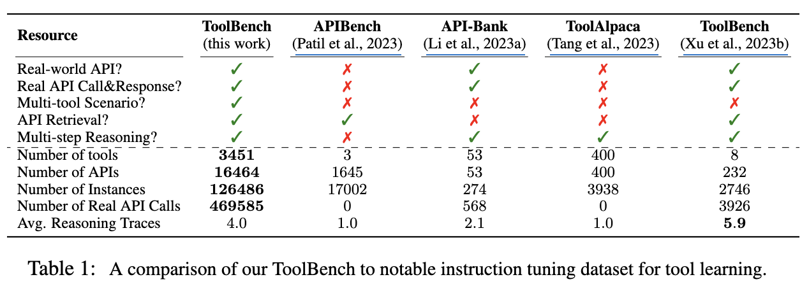
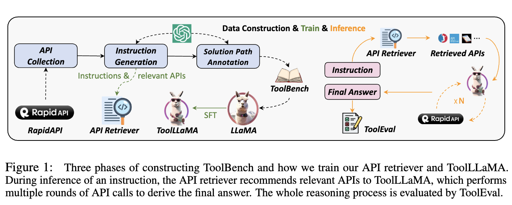
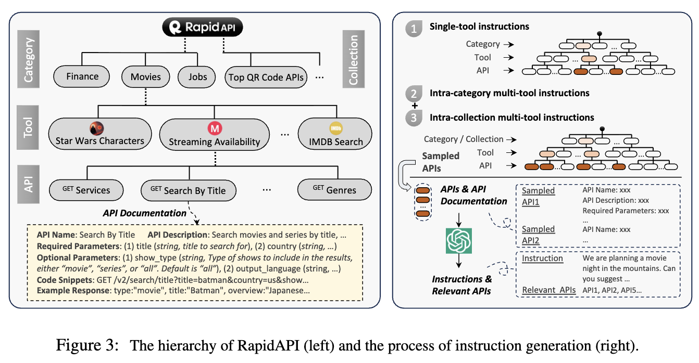
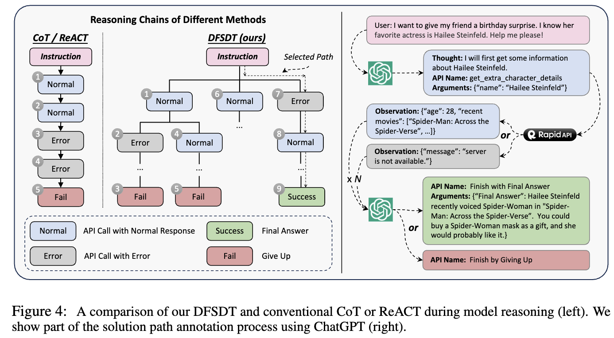
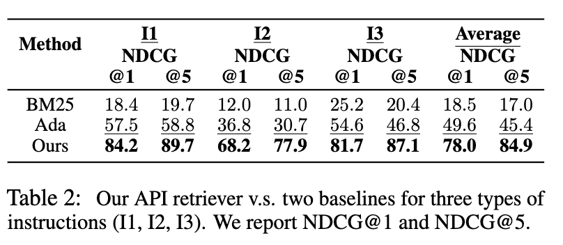
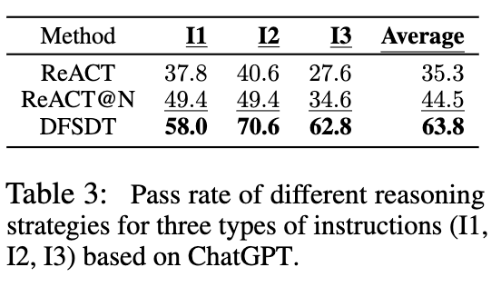
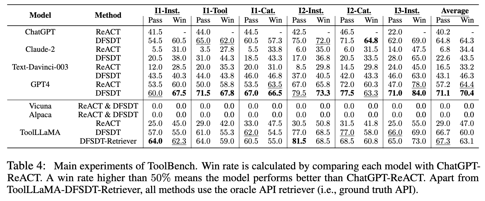
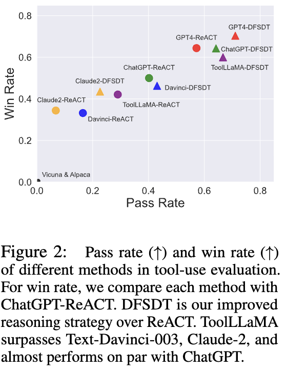
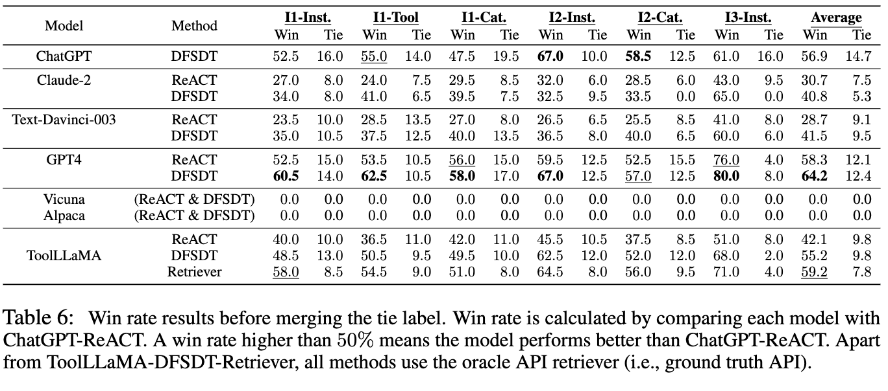
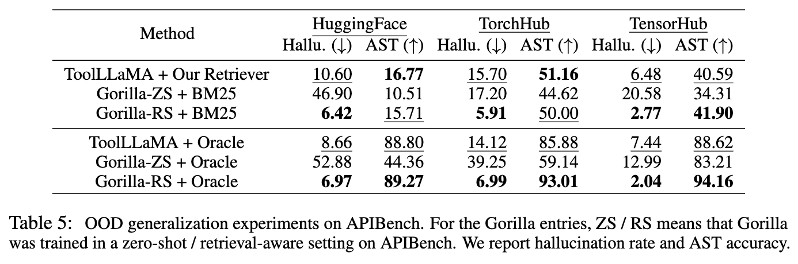

# [Agent] ToolLLM: Facilitating Large Language Models to Master 16000+ Real-world APIs

- paper: https://arxiv.org/abs/2307.16789
- github: https://github.com/OpenBMB/ToolBench
- ICLR 2024 accepted (arXiv v2, '23-10-03)
- 저자: Tsinghua University (Yujia Qin, Shihao Liang 등 공동 1저자) + ModelBest / Renmin University / Yale / WeChat AI(Tencent) / Zhihu, 교신저자 Zhiyuan Liu, Maosong Sun
- downstream task: Tool Learning (Function Calling) — 사용자 instruction을 받아 RapidAPI의 실제 REST API를 여러 번 호출해 최종 답을 만드는 multi-step decision making
- 주요 용어
  - **ToolBench**: ChatGPT(gpt-3.5-turbo-16k)만으로 자동 구축한 tool-use instruction tuning 데이터셋. 3,451 tool / 16,464 API / 126,486 instance
  - **I1 / I2 / I3**: instruction 난이도 구분. I1 = single-tool, I2 = intra-category multi-tool, I3 = intra-collection multi-tool
  - **DFSDT** (Depth-First Search-based Decision Tree): CoT/ReACT의 단일 경로 추론을 decision tree 탐색으로 확장한 추론 전략. 실패 노드에서 되돌아가 새 가지를 펼침
  - **ToolEval**: ChatGPT 기반 자동 평가기. $\text{pass rate}$(제한된 budget 내 완수 여부)와 $\text{win rate}$(두 solution path 중 어느 쪽이 나은지) 두 지표
  - **solution path**: instruction $\text{Inst}_*$에 대한 action sequence $\{a_1, \cdots, a_N\}$. 각 $a_t$는 `Thought / API Name / Parameters` 형식

# 1. Motivation

- 오픈소스 LLM(LLaMA, Vicuna, Alpaca 등)은 instruction tuning으로 대화 능력은 따라잡았지만, **tool-use 능력에서는 ChatGPT/GPT-4와 격차가 큼**
  - 현재 instruction tuning이 기본 언어 태스크에 치우쳐 있고 tool-use 도메인을 거의 다루지 않기 때문
  - SOTA 모델은 closed-source라 내부 메커니즘이 불투명 $\to$ AI 기술의 민주화를 막음

- 기존 tool-learning 데이터셋(APIBench, API-Bank, ToolAlpaca 등)의 한계를 3가지로 정리

  1. **limited APIs**: 실제 REST API를 아예 쓰지 않거나(emulated), 쓰더라도 수십~수백 개 수준의 좁고 다양성 낮은 API 풀
  2. **constrained scenario**: instruction 하나에 tool 하나만 관여함. 실제로는 여러 tool이 multi-round로 얽혀야 풀리는 태스크가 많고, 또 사용자가 사전에 이상적인 API 집합을 직접 지정해야 하는 설정은 대규모 API 풀에서 비현실적임
  3. **inferior planning and reasoning**: CoT 또는 ReACT만 사용 $\to$ 복잡한 instruction을 못 풂. 심지어 API를 실제로 실행하지 않아 후속 planning의 핵심 정보인 real response가 없음

ToolBench vs APIBench / API-Bank / ToolAlpaca / 기존 ToolBench 비교 — real-world API, 실제 호출, multi-tool, API retrieval, multi-step reasoning 지원 여부 및 규모

- Table 1 기준 ToolBench는 3,451 tool / 16,464 API / 126,486 instance / 469,585 real API call / 평균 reasoning trace 4.0으로, 5개 항목(real-world API, real call&response, multi-tool, API retrieval, multi-step reasoning)을 모두 만족하는 유일한 데이터셋

  $\to$ (Research Question) ChatGPT만으로 최소한의 사람 개입으로 **실제 API 위에서 실행 검증된** tool-use 데이터를 대규모로 만들고, 그걸로 오픈소스 LLM이 unseen API까지 다루게 할 수 있는가?

# 2. Contribution

- **ToolBench** 구축: API collection $\to$ instruction generation $\to$ solution path annotation 3단계 자동 파이프라인. 전 과정이 ChatGPT 기반이라 새 API로 확장이 쉬움
- **DFSDT** 제안: ReACT의 error propagation / limited exploration 문제를 decision tree 탐색으로 해소. 주석 단계에서는 annotation 효율을, 추론 단계에서는 성능을 올림
- **ToolEval** 제안: pass rate / win rate 두 지표의 ChatGPT 자동 평가기. 사람 평가와 pass rate 87.1%, win rate 80.3% 일치
- **ToolLLaMA** 학습: LLaMA-2 7B를 ToolBench로 fine-tune. DFSDT와 결합 시 ChatGPT에 거의 맞먹고 Text-Davinci-003, Claude-2를 능가
- **API Retriever** 학습: 16,000+ API 풀에서 instruction에 맞는 API를 추천하는 Sentence-BERT 기반 dense retriever. 수동 API 지정 없이도 동작하는 end-to-end 파이프라인 완성
- **OOD 일반화**: 학습에 쓰지 않은 APIBench에서도 APIBench 전용으로 학습된 Gorilla와 대등하거나 상회

ToolBench 3단계 구축 과정 + API retriever / ToolLLaMA 학습 및 추론 전체 구조

# 3. Dataset Construction

## 3.1 API Collection

- **RapidAPI Hub**에서 수집. 계층 구조는 category(49개 coarse-grained) / collection(500+ fine-grained) $\to$ tool $\to$ API
  - 각 API마다 name, description, HTTP method, required/optional parameter, request body, 실행 가능한 code snippet, example response를 크롤링

RapidAPI 계층 구조(좌) 및 instruction 생성 과정(우)

- **API Filtering**: 처음 수집한 10,853 tool (53,190 API)에서
  1. *initial testing*: 기본 동작하지 않는 API 폐기
  2. *example response evaluation*: 응답 시간이 지속적으로 긴 API 제거, HTML 소스코드나 에러 메시지 같은 저품질 응답 API 제거

  $\to$ 최종 **3,451 tool (16,464 API)** 만 남김

- **API Response Compression** (Appendix A.2): 응답이 길어 context를 잡아먹는 문제 $\to$ ChatGPT로 API별 불필요 key를 제거하는 compression schema를 미리 뽑아두고, 추론 시 응답이 1024 token을 넘으면 압축. 압축 후에도 1024를 넘으면 앞 1024 token만 사용

## 3.2 Instruction Generation

- 기존 방식(instruction을 먼저 쓰고 API를 찾음)과 반대로, **API 조합을 먼저 샘플링한 뒤 그 조합을 쓰는 instruction을 생성**
- API 집합 $\mathbb{S}_{\text{API}}$에서 몇 개를 뽑아 $\mathbb{S}_N^{\text{sub}} = \{\text{API}_1, \cdots, \text{API}_N\}$를 만들고, ChatGPT에게 (1) 가능한 instruction $\text{Inst}_*$ 와 (2) 각 instruction의 relevant API $\mathbb{S}_*^{\text{rel}} \subset \mathbb{S}_N^{\text{sub}}$ 를 함께 생성시킴

$$\text{ChatGPT}\big(\{[\mathbb{S}_1^{\text{rel}}, \text{Inst}_1], \cdots, [\mathbb{S}_{N'}^{\text{rel}}, \text{Inst}_{N'}]\} \mid \text{API}_1, \cdots, \text{API}_N, \text{seed}_1, \cdots, \text{seed}_3\big)$$

- prompt는 (1) 태스크 설명 (2) 각 API의 전체 문서 (3) in-context seed example 3개로 구성. seed는 사람이 작성한 single-tool 12개 / multi-tool 36개 풀에서 매번 3개 랜덤 샘플링

- **Sampling Strategy**: tool 간 연결이 sparse해서 전체 풀에서 랜덤 조합하면 서로 무관한 tool 묶음이 나옴 $\to$ RapidAPI 계층 정보를 활용
  - **I1 (single-tool)**: 각 tool을 순회하며 그 tool의 API들로 instruction 생성
  - **I2 (intra-category multi-tool)**: 같은 category에서 tool 2-5개 샘플링, tool당 최대 3개 API
  - **I3 (intra-collection multi-tool)**: 같은 collection에서 동일 방식

- hallucinated API(실제 $\mathbb{S}_N^{\text{sub}}$에 없는 API)를 참조한 instruction은 필터링
- 최종 약 200k (instruction, relevant API) 쌍 — **I1 87,413 / I2 84,815 / I3 25,251**

## 3.3 Solution Path Annotation — DFSDT

- 각 instruction을 ChatGPT와의 multi-round 대화로 캐스팅. round $t$에서 $\text{ChatGPT}(a_t \mid \{a_1, r_1, \cdots, a_{t-1}, r_{t-1}\}, \text{Inst}_*)$, $r_*$는 **실제 API 응답**
- 각 API를 ChatGPT의 function call field에 넣어 호출. 여기에 종료용 함수 2개 추가
  - `Finish with Final Answer`: 최종 답변을 파라미터로 받음
  - `Finish by Giving Up`: 주어진 API로 못 푸는 경우

- **ReACT/CoT의 한계**
  1. **error propagation**: 한 번 잘못된 action이 연쇄돼 모델이 faulty loop(같은 API를 계속 잘못 호출, API hallucination)에 갇힘
  2. **limited exploration**: 단일 방향만 탐색해 GPT-4조차 valid path를 못 찾는 경우가 많음

- **DFSDT**: decision tree를 만들어 (1) 유망한 경로를 따라가거나 (2) 현재 노드를 `Finish by Giving Up`으로 포기하고 새 가지를 펼침
  - 노드 확장 시 **이전에 생성된 형제 노드 정보를 prompt에 넣어 명시적으로 다른 노드를 만들도록 유도**
  - BFS는 OpenAI API 호출 비용이 과함 $\to$ DFS 채택 (valid path 하나만 찾으면 주석 완료이므로)
  - (Appendix A.4) 실제로는 child node 정렬(랭킹)을 생략하고 **pre-order traversal** 사용. 대부분 처음 생성된 노드가 최고 점수라는 경험적 관찰 때문. 덕분에 모델이 retract를 안 하면 DFSDT는 ReACT로 degrade되어 비용이 같아짐
  - ToolLLaMA는 DFSDT 데이터로 학습하지만 추론 시 ReACT / DFSDT 둘 다 사용 가능

CoT/ReACT vs DFSDT 추론 경로 비교(좌) 및 ChatGPT 기반 solution path annotation 예시(우)

- 전체 instruction에 DFSDT를 돌려 통과한 path만 보존 $\to$ 최종 **126,486 (instruction, solution path)** 쌍

# 4. ToolEval

- RapidAPI는 시간에 따라 응답이 바뀌고 한 instruction에 valid path가 무한히 많음 $\to$ 고정 ground-truth path 주석이 불가능
- AlpacaEval을 따라 ChatGPT 기반 자동 평가기 설계

  1. **Pass Rate**: 제한된 budget 내 instruction 완수 비율. ideal tool use의 *기본 요건*
     - instruction을 solvable / unsolvable로 먼저 구분하고, finish type(`Final Answer` vs `Giving Up`)과 결합해 Pass / Fail / Unsure 판정 규칙을 정의
     - 예) solvable인데 API를 몇 개만 호출하고 포기 $\to$ Fail / API가 유효 정보를 못 줘서 전부 시도 후 포기 $\to$ Pass
     - unsolvable인데 "완료했습니다"라고 거짓 양성 응답 $\to$ Fail
  2. **Win Rate**: 두 solution path 중 어느 쪽이 더 나은지 비교. 둘 다 Pass이거나 둘 다 Fail인 경우만 비교
     - 기준 6가지: information richness / factuality / reasoning / milestone 도달 수 / exploration(더 많은 유용 API 시도) / cost(중복 호출이 적을수록 좋음)

- 두 지표 모두 평가기가 $\geq 4$회 예측 후 majority vote
- **사람 평가와의 일치율: pass rate 87.1%, win rate 80.3%**
  - 단, 저자들도 인정하듯 사람 평가자끼리도 "적은 API로 빨리 답" vs "많은 API로 교차검증" 중 뭐가 나은지 자주 불일치함 $\to$ tool-use 평가는 여전히 열린 문제

# 5. Experiments

## 5.1 API Retriever

- Sentence-BERT로 BERT-BASE를 학습. instruction과 API 문서를 각각 임베딩해 유사도로 relevance 계산
- §3.2에서 생성한 relevant API를 positive, 나머지를 negative로 contrastive learning
- baseline: BM25, OpenAI *text-embedding-ada-002*. 지표는 NDCG@1 / @5

API retriever vs BM25 / Ada — I1, I2, I3별 NDCG@1, NDCG@5

- I1(84.2) > I3(81.7) > I2(68.2) 순으로 NDCG@1이 높음 $\to$ single-tool 검색이 multi-tool보다 쉬움

## 5.2 DFSDT vs ReACT

- 공정 비교를 위해 **ReACT@N** baseline 추가 (DFSDT와 같은 총 호출 수가 될 때까지 ReACT를 반복, 한 번이라도 성공하면 pass)

ChatGPT 기준 ReACT / ReACT@N / DFSDT의 I1, I2, I3 pass rate

- 같은 budget에서도 DFSDT가 ReACT@N 대비 **+19.3pp** $\to$ 단순 반복이 아니라 탐색 구조 자체가 기여
- **난이도가 높을수록(I2, I3) 개선 폭이 큼**. ReACT로는 몇 번을 반복해도 못 푸는 hard example이 DFSDT 덕에 데이터에 포함됨

## 5.3 Main Results

- **ToolLLaMA**: LLaMA-2 7B를 instruction-solution 쌍으로 fine-tune
  - API 응답이 길어 4096 context로는 부족 $\to$ **position interpolation (ratio 2)으로 8192까지 확장**
  - (Appendix A.3) lr $5 \times 10^{-5}$, warmup ratio $4 \times 10^{-2}$, batch size 64, max seq len 8192, 2 epoch
- **일반화 평가 3단계**: (1) **Inst.**: 학습에 쓰인 tool에 대한 unseen instruction, (2) **Tool**: 학습에 쓰인 category 안의 unseen tool, (3) **Cat.**: 학습에 없던 category의 unseen tool
- baseline: Vicuna, Alpaca, ChatGPT(teacher), Text-Davinci-003, Claude-2, GPT-4. win rate는 ChatGPT-ReACT 기준

ToolBench 메인 실험 — 6개 시나리오별 pass rate / win rate

주요 관찰:

1. **Vicuna / Alpaca는 pass rate·win rate가 전 시나리오 0.0** — 프롬프트 엔지니어링을 많이 해도 instruction 하나도 통과하지 못함. 현행 instruction tuning이 tool-use 도메인을 전혀 커버하지 못한다는 방증
2. 모든 LLM에서 DFSDT > ReACT. 특히 **ChatGPT+DFSDT (64.8)가 GPT-4+ReACT (57.2)를 pass rate에서 역전**
3. ToolLLaMA+DFSDT는 Text-Davinci-003·Claude-2를 크게 상회하고 teacher인 ChatGPT와 거의 동등 (66.7 vs 64.8). GPT-4+DFSDT에만 뒤처짐
4. **API Retriever가 oracle API set보다 오히려 낫다** (67.3 vs 66.7 pass, 63.1 vs 60.0 win)
   - ground-truth API set의 상당수가 더 나은 기능의 다른 API로 대체 가능한데, retriever가 그걸 찾아냄 $\to$ retriever가 relevant API의 탐색 공간을 **확장**하는 역할

pass rate / win rate 산점도 — ToolLLaMA-DFSDT가 Text-Davinci-003·Claude-2를 넘고 ChatGPT에 근접

tie를 병합하기 전 원본 win / tie 비율

## 5.4 OOD Generalization — APIBench

- APIBench(HuggingFace / TorchHub / TensorHub)로 OOD 평가. **ToolLLaMA는 추가 학습 없이** 각 API를 function call로 주고, API를 선택해 호출 코드와 출력 설명을 생성하는 함수 하나를 정의해 사용
- 비교 대상 Gorilla는 APIBench 학습 데이터로 fine-tune된 LLaMA-7B. ZS(zero-shot) / RS(retrieval-aware) 두 공식 설정
- 지표: hallucination rate (↓), AST accuracy (↑)

APIBench OOD 일반화 — HuggingFace / TorchHub / TensorHub별 hallucination rate와 AST accuracy

- ToolLLaMA+retriever가 **AST accuracy에서 Gorilla+BM25(ZS/RS 모두)를 HuggingFace·TorchHub에서 상회**. TensorHub만 Gorilla-RS가 근소 우위
- 같은 oracle retriever에서는 Gorilla-ZS를 전 도메인 압도. Gorilla-RS(해당 데이터 학습)가 AST에서는 여전히 최고
- 반대 방향(Gorilla $\to$ ToolBench)은 성립하지 않음. ToolBench의 multi-tool / multi-step 설정이 더 복잡해서 Gorilla는 일반화 불가

# 6. Conclusion & Limitations

- 요약: ChatGPT만으로 16k+ 실제 API 위의 tool-use 데이터를 자동 합성하고(ToolBench), 탐색 기반 추론(DFSDT)으로 주석 효율과 성능을 동시에 올리고, 자동 평가기(ToolEval)로 측정하며, 7B 오픈소스 모델(ToolLLaMA)이 ChatGPT급 tool-use 능력에 도달함을 보임

- 저자들이 밝힌 한계 / 읽으면서 보이는 지점

  - **평가 자체의 신뢰도**: ChatGPT 평가기와 사람의 일치율이 87.1% / 80.3%지만, 애초에 사람끼리도 "무엇이 더 나은 solution path인가"에서 자주 불일치함. 저자들도 "fair evaluation까지 갈 길이 멀다"고 명시
  - **응답 압축의 정보 손실**: 1024 token 압축 후에도 길면 앞부분만 자름 $\to$ 뒤쪽 레코드가 날아가는 구조적 손실 가능
  - **temporal variability**: live RapidAPI 위에서 평가하므로 시점에 따라 응답이 바뀜. 재현성 확보를 위해 같은 API 버전을 써야 한다는 제약
  - **distillation 상한**: 학습 데이터가 ChatGPT가 DFSDT로 통과시킨 path만으로 구성됨 $\to$ ChatGPT가 못 푸는 영역은 애초에 데이터에 없음. ToolLLaMA가 teacher를 넘기 어려운 구조적 이유
  - **DFSDT의 추론 비용**: pass rate를 크게 올리지만 그만큼 호출 수가 늘어남. pre-order traversal로 완화했을 뿐 근본적으로 ReACT보다 비쌈
  - APIBench OOD에서 oracle retriever를 쓰면 해당 도메인 전용 학습 모델(Gorilla-RS)에 AST accuracy가 여전히 밀림

# Takeaways

- **데이터 생성 방향을 뒤집은 것**이 핵심 설계. instruction을 먼저 쓰고 API를 찾는 대신 API 조합을 먼저 뽑고 instruction을 생성 $\to$ 16k API를 빠짐없이 커버하고 multi-tool 시나리오를 자연스럽게 만듦
- **계층 정보(category/collection)로 tool 조합을 샘플링**한 것이 multi-tool instruction 품질의 실질적 열쇠. 랜덤 조합은 서로 무관한 tool 묶음만 만듦
- DFSDT는 추론 전략이자 **데이터 주석 전략**. ReACT로 못 푸는 hard example을 데이터에 끌어들여 모델의 상한을 올림 — "탐색으로 얻은 성능을 증류로 내재화"
- Retriever가 oracle API set보다 좋은 결과를 낸 점은 시사적. **사람이 지정한 "정답 API"가 실제로는 최적이 아닐 수 있음**
- Vicuna/Alpaca의 전 시나리오 0.0은 일반 대화 instruction tuning과 tool-use가 별개 능력임을 보여주는 강한 증거
