# [Agent] MLE-STAR: Machine Learning Engineering
Agent via Search and Targeted Refinement

- paper: https://arxiv.org/pdf/2506.15692
- github: https://github.com/WalkingDevFlag/MLE-STAR-Open (Unofficial)
- NeurIPS 2025 accepted (인용수: 18회, '26-03-17 기준)
- Downstream task: Machine Learning Engineer Agent

# 1. Motivation

- 기존 MLE 자동화 연구
  - MLE Agent task를 "코드 최적화" 문제로 바라보고 해결하고자 함
- MLE Agent task에서 기존의 방식들은 2가지 한계점 존재
  - LLM의 내재된 지식 (inherent knowledge)에 강하게 의지하여, 최신 모델을 선택하지 못함. $\to$ Web search를 잘 수행하면 해결 할 수 있지 않을까?
  - 거친 (코드) 수정 전략을 통해 전체 코드를 한번에 수정함 $\to$ Ablation Study를 통해 일부 ML Component만 타켓하여 반복적으로 수정 전략을 수행할 수 있지 않을까?

# 2. Contribution

- **ML E**ngineering agent에 web **S**earch와 **TA**rgeted code block **R**efinement를 수행하는 MLE-STAR를 제안함

  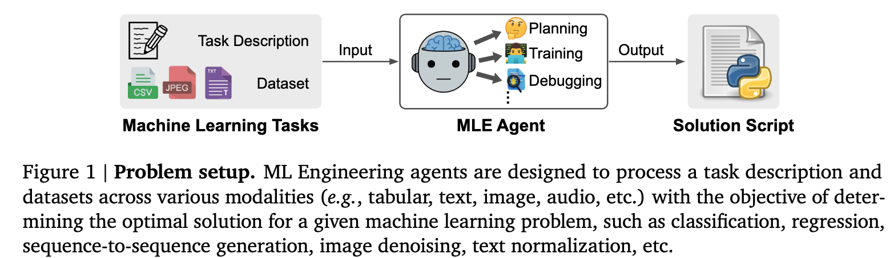

- MLE-bench Kaggle 대회에서 SOTA를 찍음 (25.8% $\to$ 63.6%)

# 3. MLE-START

- Overview

  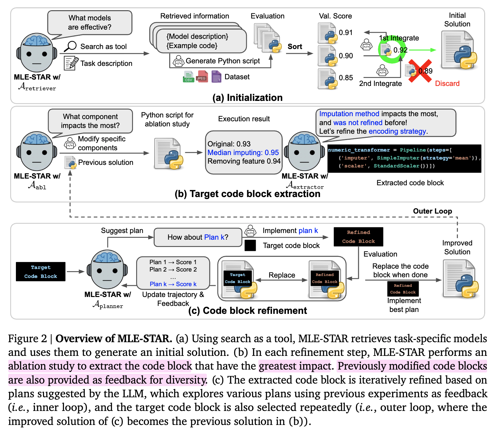

## 3.1 Web Search를 Tool로 활용하여 Inital Solution을 생성

- LLM이 pretraining시에 자주 본 친근한 패턴의 solution만 제공하고, 최신 solution을 제공하지 못하는 경향을 가짐.

  ex. LLM의 내장된 지식 활용 시 테스크에 맞지 않게 logistic regression 으로만 해결하려는 경향을 보임

- 이를 해결하고자 초기 solution을 만들때, web search를 tool로 제공하여 *M*개의 최신 모델을 선택하도록 retriever를 둠

  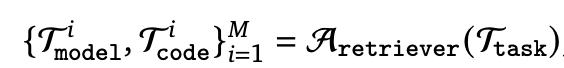

- LLM이 최신 모델에 대한 이해도가 없으므로 (친근하지 않으므로) 적절한 guidance code로 함께 제공해줘야 함

  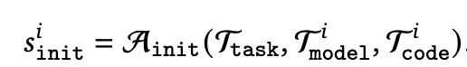

- Ensemble 결과 

  - 모델의 test score를 기준으로 내림차순 정렬

    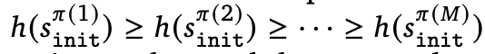

    - $h$: score

  - Merge Agent가 통합하며 best score를 남긴다.

    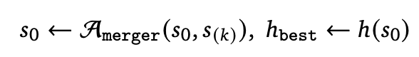

## 3.2 Code Block단위로 Solution 수정

- *T* step동안 수정하며 더 좋은 score를 갖는 solution (code)를 얻는게 목표

- 2개의 프로세스로 구성

  - target code block을 추출하는 단계

    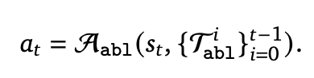

    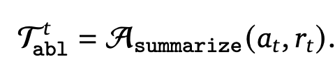

    - $a_t$: 현재 step의 solution $s_t$ 코드를 ablation study하기 위해 Ablation agent가 작성한 코드. 

    - $T_{abl}$: 이전 step들에서 수행했던 ablation studies의 요약된 context. Summary Agent가 생성함

      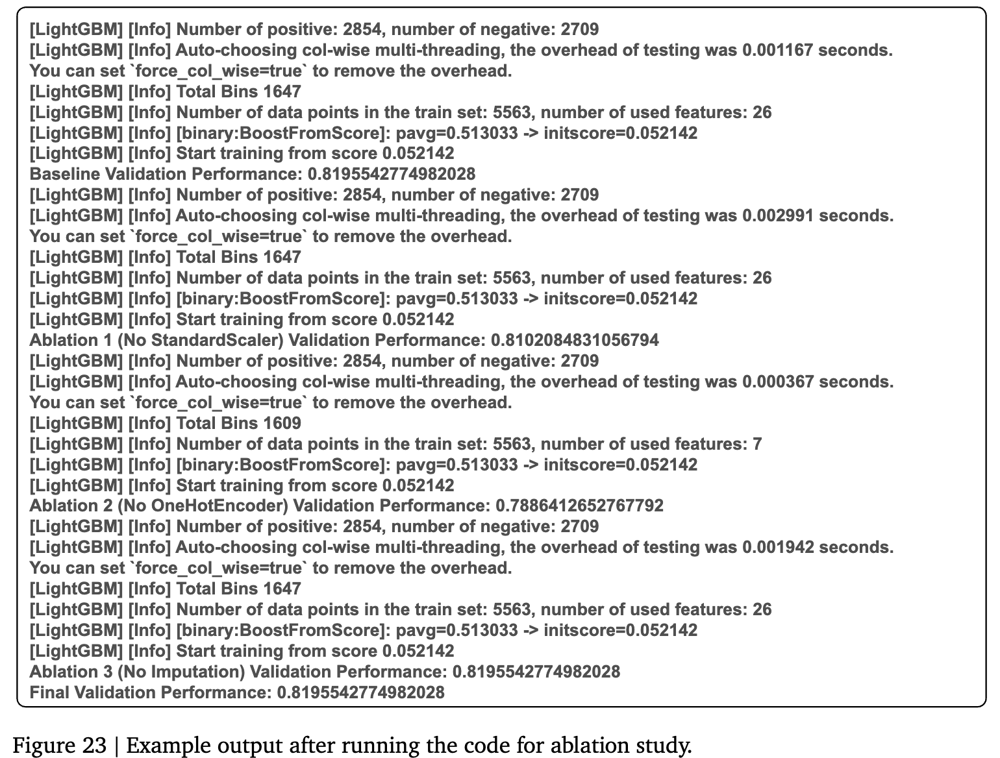

    - $r_t$: 수행된 log 결과

    - 제일 중요한 부분을 추출하는 추출기 Agent (Extractor)가 핵심 code block를 추출함. 즉, 수정했을 때 score에 가장 큰 영향을 주는 코드 부분을 찾음

      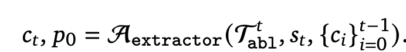

    - $p_0$: 초기 수정할 계획

    - $c_t$: t step에 refined된 code block

  - code block를 수정하는 단계

    - 수정 계획 $p_0$를 기반으로 coder agent가 코드를 수정함

      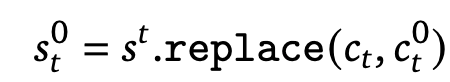

    - Plan Agent는 K번 plan을 짜고, inner-loop를 돌리면서 plan을 갱신함

      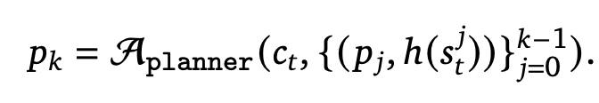

    - 매 Plan ($p_k$)마다 code agent는 code block을 짜고 $c_t^k$, 잠재 solution $s_t^k=s_t.\text{replace}(c_t,c_t^k)$를 생성함.

    - 이중 제일 best-performance candidate solution을 추출하여 next step의 solution으로 둠 $s_{t+1}$

      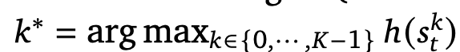

## 3.3 Ensemble 전략 활용하여 성능 극대화

- 각각의 차선책들 (solution들)이 서로 상호 보완할 수 있으므로, Ensemble을 통해 성능을 극대화 시도

- MLE-STAR의 계획하는 능력을 바탕으로 emsemble 전략도 탐험하도록 수행 (emsemble agent)

- 이전의 emsemble 결과들의 score history를 feedback으로 받아 ensemble plan ($e_t$)를 생성함

  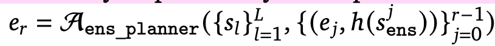

  - $e_r$: r번째 ensemble plan

- ensembler의 plan을 바탕으로 최종 ensemble solution 생성

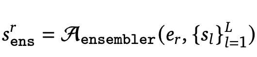

## 3.4 Robust한 MLE Agent를 위한 추가 모듈

- Python script의 Error가 났을때 디버깅 해주는 agent

  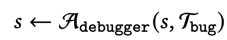

- Test Data가 leakage 발생했는지 여부를 판단하는 Data Leakage Checker

  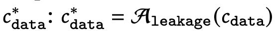

  - Train Data를 10분 활용하지 않았는지 체크 수행 (윗쪽). 만약 불충분한 데이터 사용시, 수정을 가함

    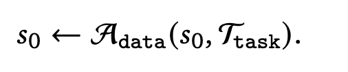

  - Train Data의 통계 분포를 바탕으로 체크 수행 (아래쪽)

    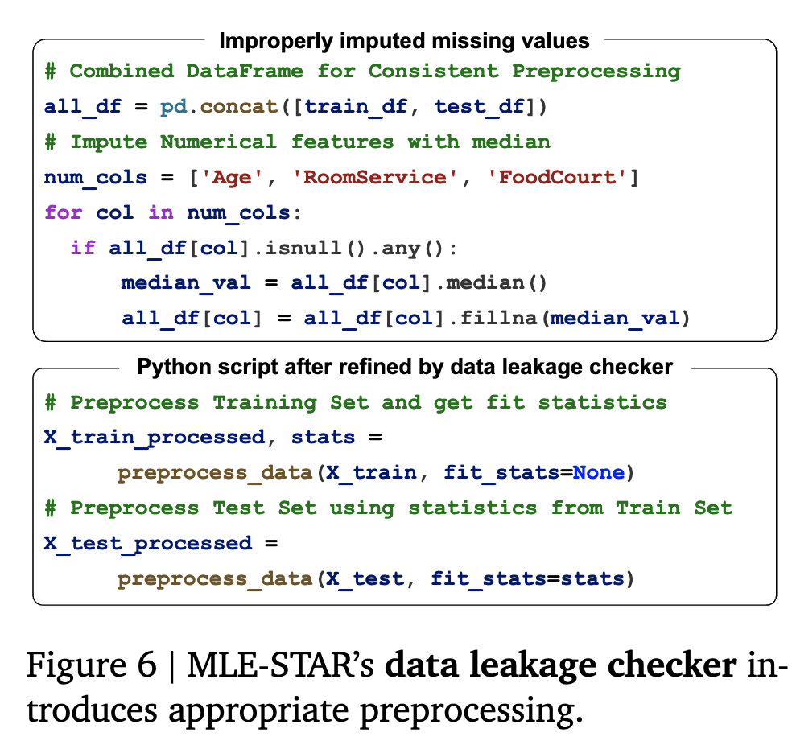

# 4. Experiments

- Evaluation

  - Kaggle 대회에서 평균 이상 여부를 체크

- 정량적 결과

  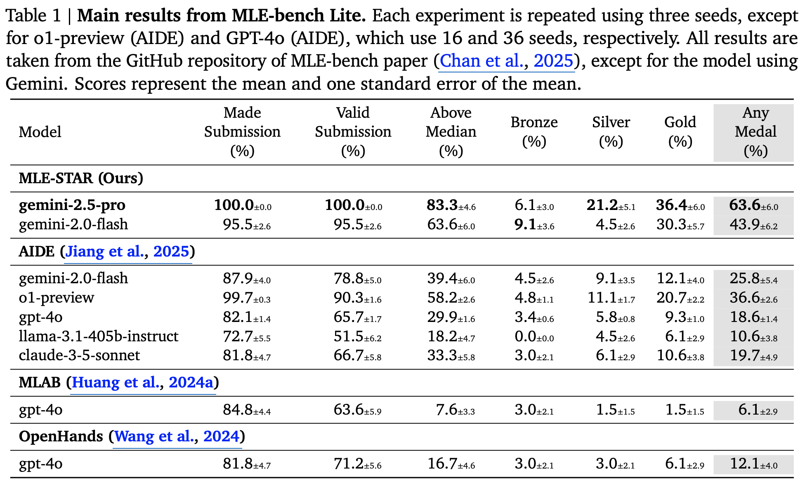

- DS Agent와 비교 & Sonnet-4과 비교

  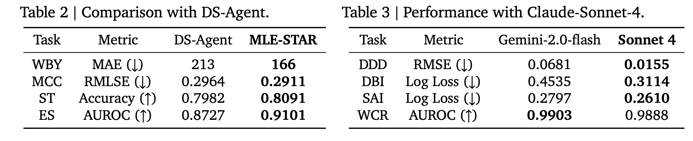

- Ablation Studies

  - Ensemble 전략

    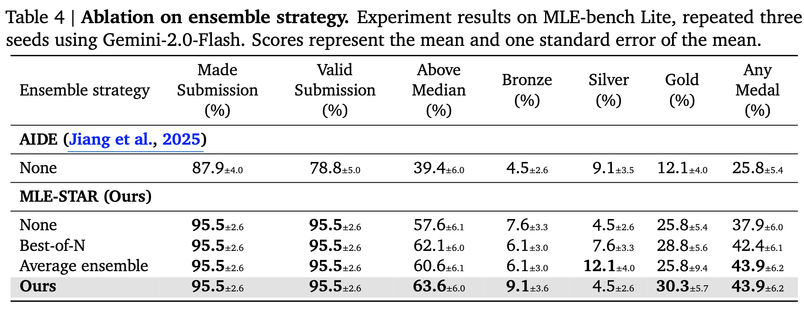

- Discussions

  - 정성적 결과

    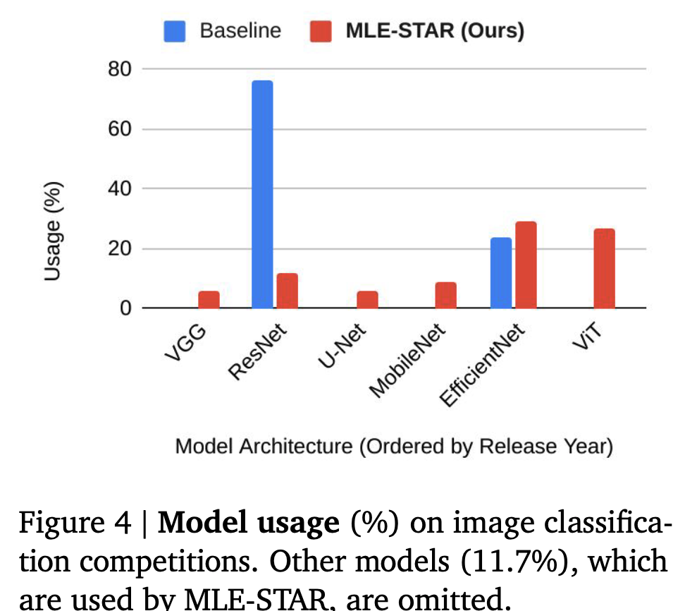

    - MLE-STAR가 최신 모델 (ViT, EfficientNet을 사용함. > ResNet)

  - 사람의 최소 개입도 허용하는 interface 제공

    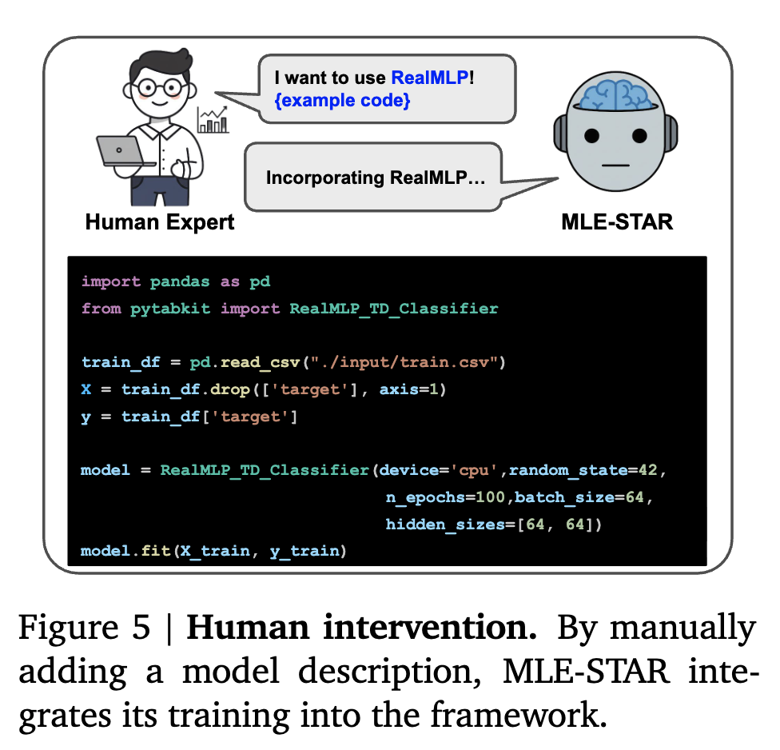

  - Data Leakage 유무에 따른 성능 비교

    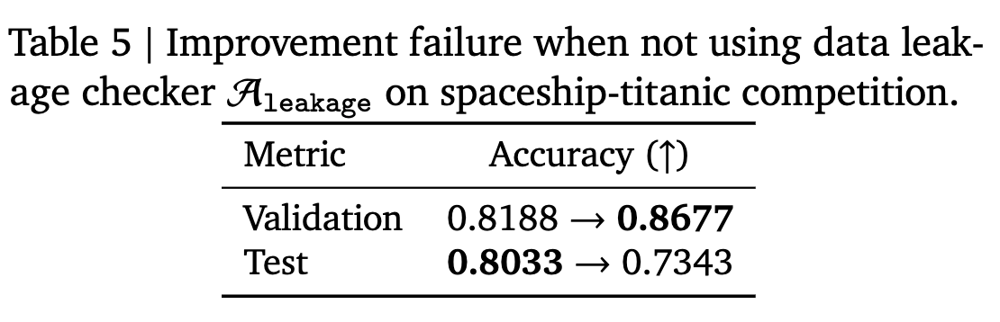

  - Data Checker 유무에 따른 성능 비교

    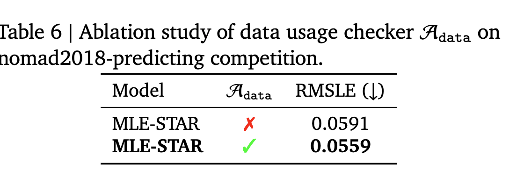

  - 반복해서 개선되는 Trajectory

    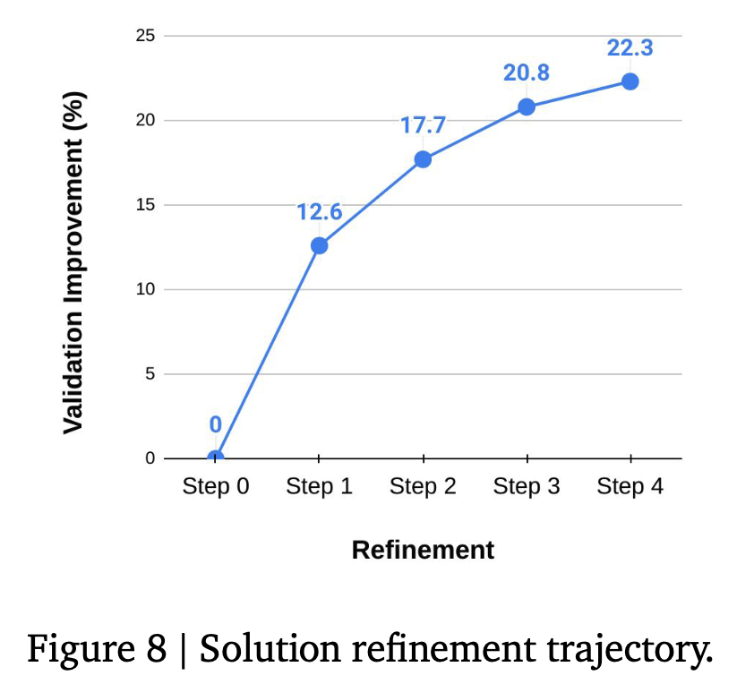