# [HLG]\[LMM] Graphic Design with Large Multimodal Model

- paper: https://arxiv.org/pdf/2404.14368
- github: https://github.com/graphic-design-ai/graphist (깡통)
- Archived '24.04.23 (인용수: 0회, '24-07-09 기준)
- downstream task: Hierarchical Layout Generation, Content-aware Layout Generation, Content-agnostic Layout Generation

# 1. Motivation

- 기존에 (Content-aware) Layout Generation는 unordered layout generation을 가정한다.

  - 하지만, element간 ordering은 최종 design결과물에 많은 영향을 미친다. 

  $\to$ 이를 layer sequencing을 통해 고려해보자!

  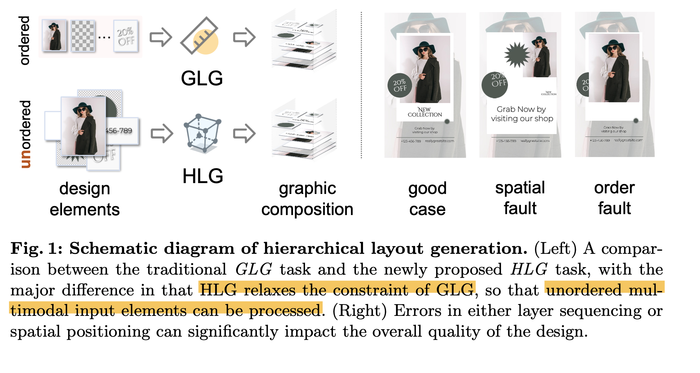

# 2. Contribution

- Element의 공간적 배열과 layer의 순서를 고려하여 심미적으로 우수한 graphic composition을 다루는 Hierarchical Layout Generation (HLG) task를 새롭게 제안함
- end-to-end로 학습가능한 LMM (Large Multimodal Model)을 근간한 Graphist를 제안함
  - input: **unordered** RGB, RGB-A, text
  - output: element의 배치정보를 json으로 출력 $\to$ renderer를 통과하여 최종 design도출
- HLG task evaluation metric 제안
  - IOPR (Inverse Order Pair Ratio): 모델이 예측한 order가 정답 order와 다른 비율 (낮을수록 좋다?)
  - GPT-4V Eval: COAL을 참고하여 4가지 지표를 산출하여 GPT-4V로 하여금 평가하도록함
  - Human rating score

# 3. Graphist

- Hierarchical Layout Generation

  - design elements

    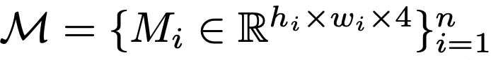

    - $h_i, w_i$: i번째 element의 height, width
    - *n*: element의 갯수
    - 4: RGB+A

  - graphic composition

    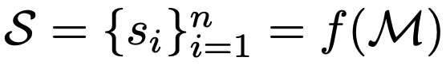

    - *S*: layout composition (json format)
    - *f*: Graphist (our Model)
    - $s_i$: $(x_i, y_i, w_i, h_i, l_i)$: $l_i$= hierarchy. (z-order)

- Graphist

  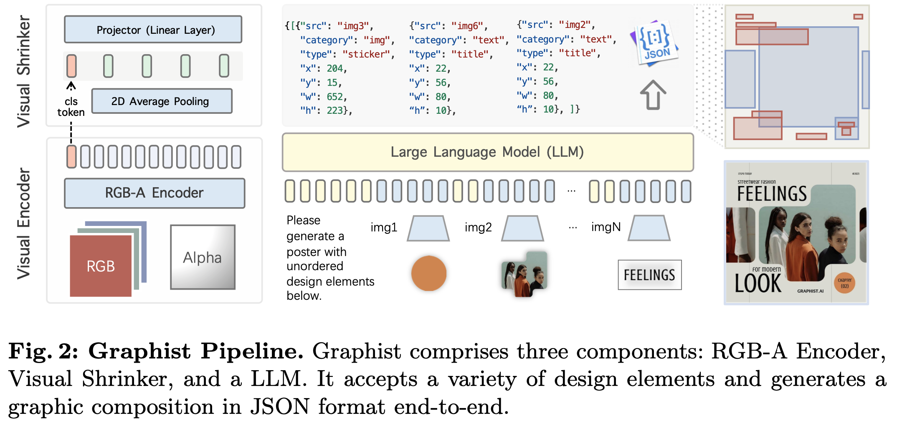

  - RGB-A Encoder: ViT-L/14 (224x224) CLIP의 visual tower를 사용 (alpha channel 제외)
  - LLM: Qwen1.5-0.5B/7B
  - Visual Shrinker: 2D Average polling layer + 1개의 MLP layer
    - input : 16x16 + 1 token
    - output: 2x2 + 1 token

- Training

  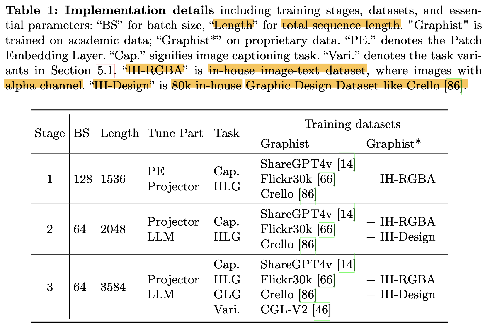

  - Stage-1: visual projector와 alpha channel이 visual + linguistic feature에 align되도록 학습
    - task: image captioning + HLG task (?)
    - patch embedding layer (?) + projector layer 만 학습
  - Stage-2: Graphic layout에 대해 모델이 더 잘 이해하도록 학습
    - task: image captioning + HLG task w/ HLG task more frequently
    - projector + LLM 학습
  - Stage-3: 
    - task: 다양한 graphic design tasks (Traditional GLG, etc)
    - projector + LLM 학습

# 4. Experiments

- Datasets

  - Crello: Layer ordering, spatial positioning, categorical detail에 대한 메타 데이터 존재하는 데이터셋 
    - SNS infographics, digital banner 광고, blog headers, printed poster templates, etc
    - Train : Val : Test = 19,095 : 1,951 : 242
  - CGL-V2: Content-aware + Content-agnostic task
    - Train : Test = 60,548 : 1,035

- Evaluation Metrics

  - IOPR (Inverse Order Pair Ratio): **전체 overlap된 element pair** 중에 **order가 정답과 inverse**가 되는 경우의 확률 (lower the better?)

    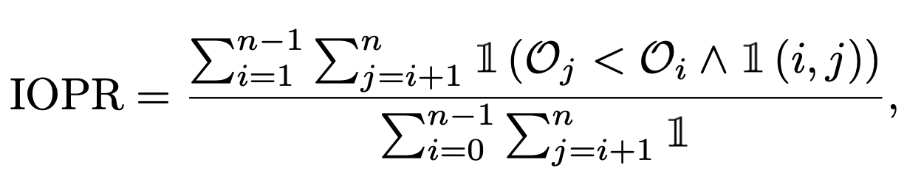

    - *n*: layer의 전체 갯수
    - $O_i, O_j$: i, j번째 layer에 대해 모델이 예측한 순서
    - $\mathbb{I}$(i,j): i, j번째 layer (element)가 overlap되었으면 1, 아니면 0

  - GPT-4V Eval: COLE에서 제안한 4가지 기준으로 평가

    - $S_{DL}$: Graphic design이 얼마나 clean, balanced, consistent layout을 생성하는지 평가
    - $S_{GI}$: Graphic이나 Image가 design을 좋게 하는가를 평가 (High quality, relevant, harmonious w/ other elements)
    - $S_{IO}$: Design의 Innovation level을 측정
    - $S_{TV}$: Text의 readability를 측정 (배경과 배색 유무, Text간 overlapping 유무 등 평가)

- 정량적 평가

  - Crello

    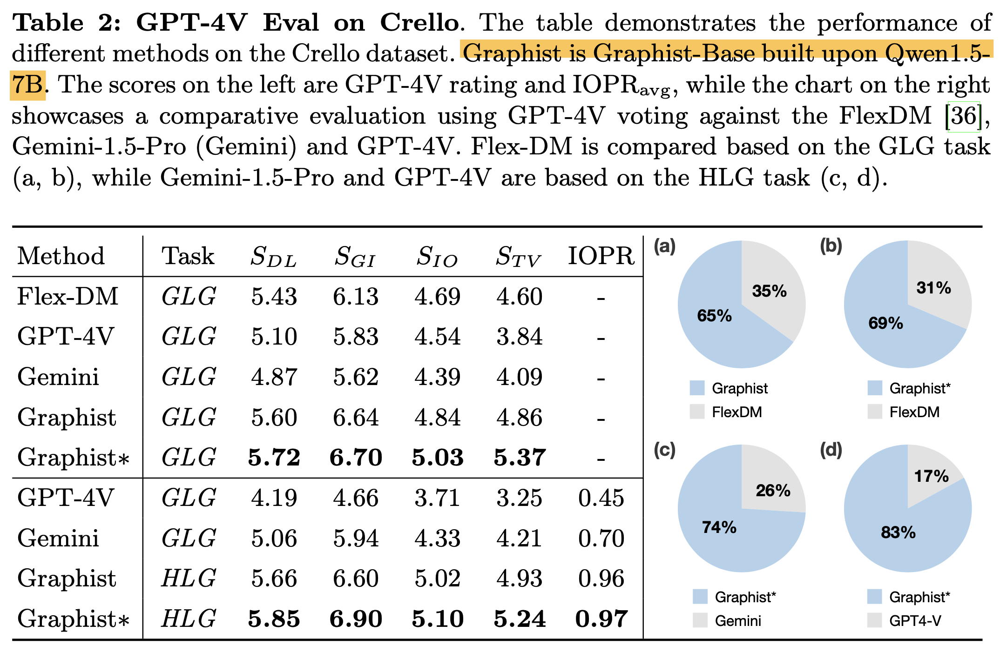

  - CGL-V2

    - Content-aware Layout Generation

      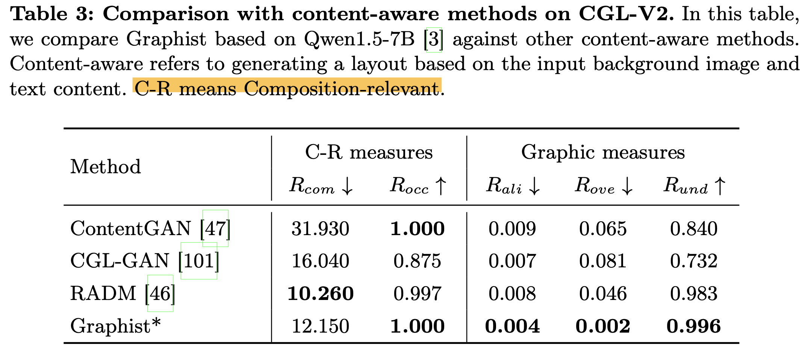

    - Content-agnoistic Layout Generation

      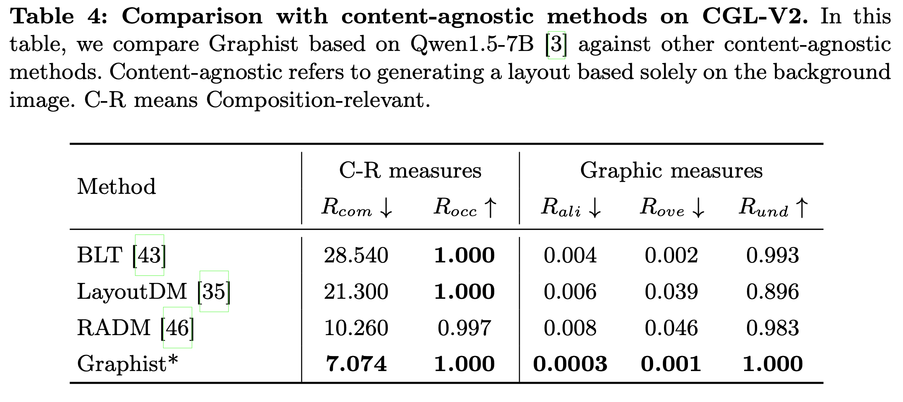

- 정성적 평가

  - Crello

    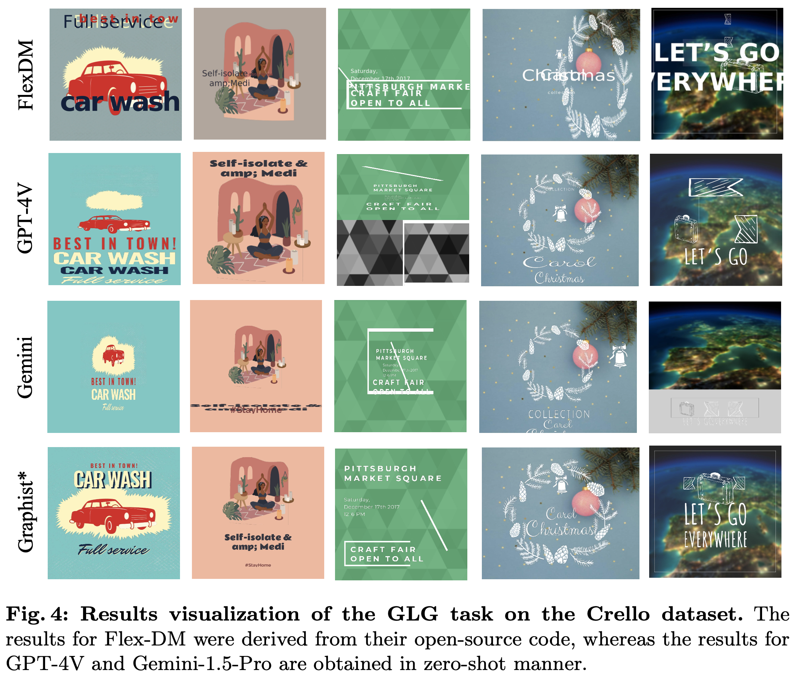

    - Graphist가 Chat-GPTv4나 Gemini보다 낫다!

  - Real-world (Complex)

    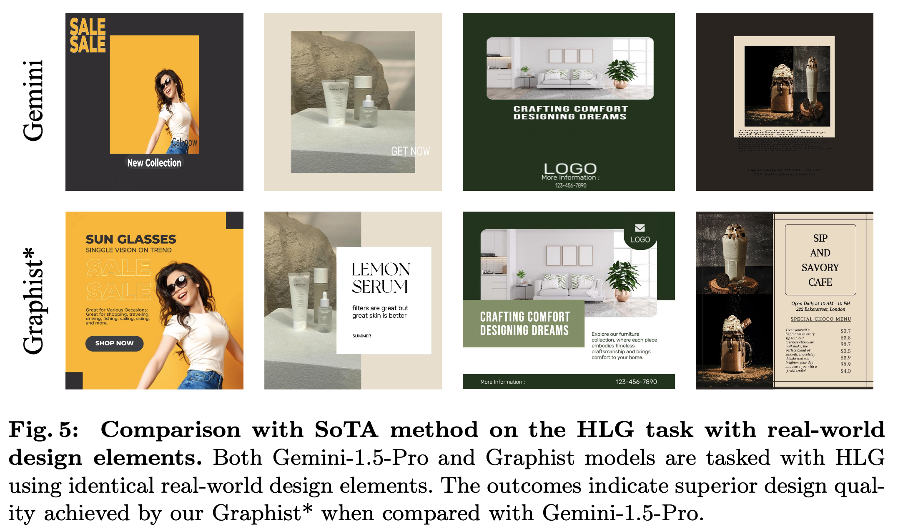

- Ablation

  - LLM

    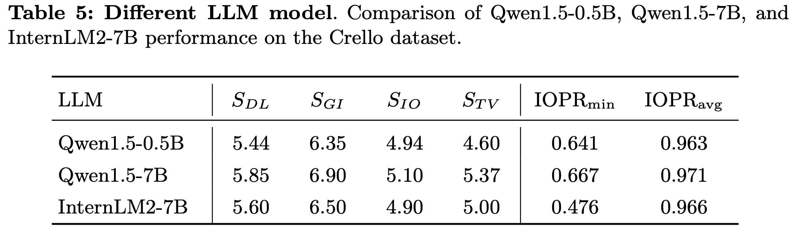

  - Input Layer sequence

    

    - 위 (ordered input) vs. 아래 (unordered input)
      - $S_{DL}, S_{GI}$: unordered가 더 좋음
      - $S_{TV}$: ordered가 더 좋음 

  - Visual token length

    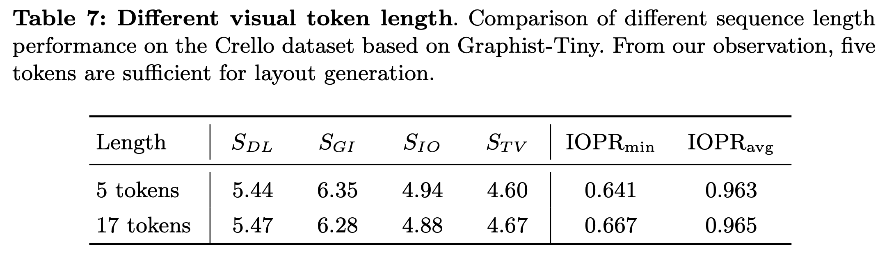

    - 5 token (2x2 pooling) vs. 17 token (4x4 pooling) Visual token 갯수가 크게 도움이 되지 않음

- RGB vs. RGB-A

  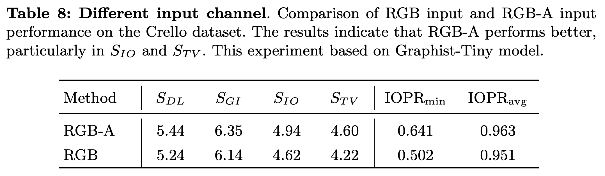

  - Alpha channel이 특히 text element를 배경과 isolate함으로써 distracting하는걸 방지함 (?)

- Real world Evaluation

  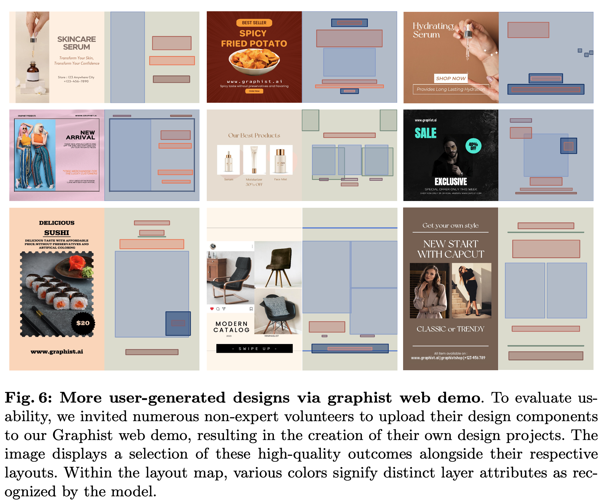