# [MM] Cobra: Extending Mamba to Multi-Modal Large Language Model for Efficient Inference

- paper: https://arxiv.org/pdf/2403.14520
- github: https://github.com/h-zhao1997/cobra
- Archived (인용수: 21회, 2024-08-21 기준)
- downstream task: VQA

# 1. Motivation

- MLLM의 근간이 되는  LLM은 전부 quadratic computation cost를 유발하는 Transformer 구조로 되어있음 $\to$ 계산량이 많이 요구됨

- Linear computation cost만 요구하는 Mamba 기반의 LM에 Visual modality를 추가한 MLLM형태는 어떨까?

  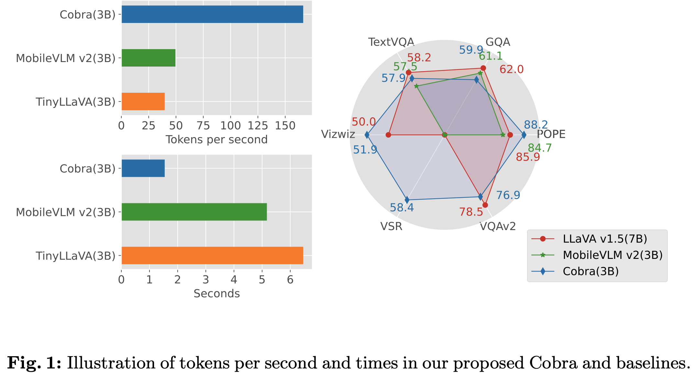

# 2. Contribution

- 기존 MLLM은 모두 **Quadratic Compuatational complexity**기반의 Transformer로 되어 있음을 발견하고, **linear computational complexity**를 갖는 MLLM 모델인 **Cobra**를 제안함
- 다양한 VIsion & Language fusion scheme를 실험하고, 최적의 Multimodal 통합 구조를 제안함
- LLaVa-7B에 비해 43%의 parameter  (2.8B)만 가지고 속도는 4~5배 빠른데 유사한 성능의 MLLM 모델을 구현함

# 3. Cobra

## 3.1 Preliminaries

- State-Space Models

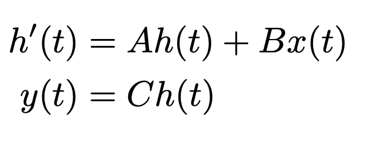

- $A \in \mathbb{R}^{n \times n}$ : state matrix for hidden state

- $B \in \mathbb{R}^{n \times 1}$: state matrix for input

- $C \in \mathbb{R}^{1 \times n}$: state matrix for output

- $x$: scalar input

- $t$: time step

  $\to$ discretized form으로 변환

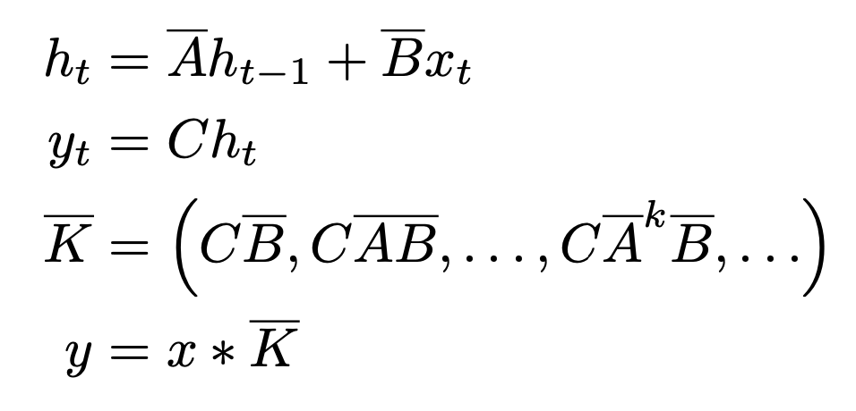

- Discretization Rule (ZOH: Zero-Order-Hold)

  

  - $\Delta$: Time-scale parameter

## 3.2 Corbra

- Overall architecture

  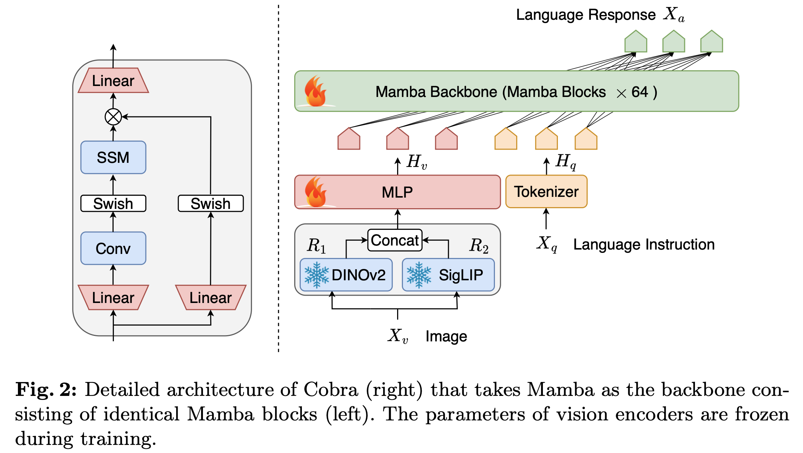

  - SSM branches

    - Convolution branch: Input data의 time-invariant dependecies를 학습
    - Swish-only branch: Gate 역할 (propagate/forget)

  - Cobra (MLLM) 구조

    - Vision encoder: DINOv2 + SigLIP

      - DINOv2: low-level spatial property를 catch

      - SigLIP: semantic properties를 catch (CLIP-vision의 loss를 Sigmoid loss로 바꾼 형태)

      - Input

        - $X_v \in \mathbb{R}^{C \times H \times W}$: input image
        - $N_v = HW / P^2$: *P*는 patch 크기, $N_v$는 patch 갯수

      - Output

        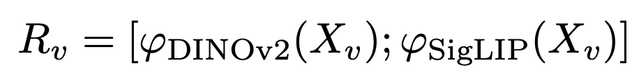

        - $R_v \in \mathbb{R}^{N_v \times D_v}$

    - Projector: vision feature와 text feature를 align하는 형태

      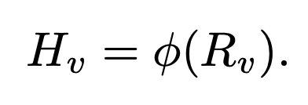

      - $\phi$: MLP + downsample projector $\to$ [10] MobileVLM 논문 참고

      - Input: Vision encoder의 output feature
      - Output: Language token이 embedding된 latent 공간에 mapping된 Visual token

    - Mamba backbone (LLM)

      - Text token과 Projector의 visual token을 입력으로 받아 target token을 autoregressive하게 생성하는 모듈

        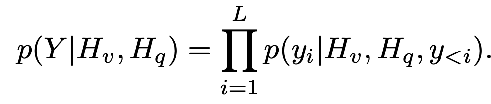

      - 64개의 basic block + residual connection + RMSNorm으로 구성

## 3.3 Training Recipe

- Dataset

  - Mixed dataset

    - LLaVA 1.5에서 사용한 academic VQA : 655K image, dialog pair (multi-turn conversations)
    - LLaVA-Instruct에서 사용한 Visual instruction Tuning data 
    - ShareGPT에서 사용한 Pure-text instruction tuning data 

  - LVIS-Instruct-4V:  220K image에 대해 GPT-4V로 instruction을 생성한 데이터셋

  - LRV-Instruct: 400K의 visual instruction dataset (16개의 VLM task를 다룸)

    $\to$ 1.2M image와 conversation으로 학습

- 학습 스케줄

  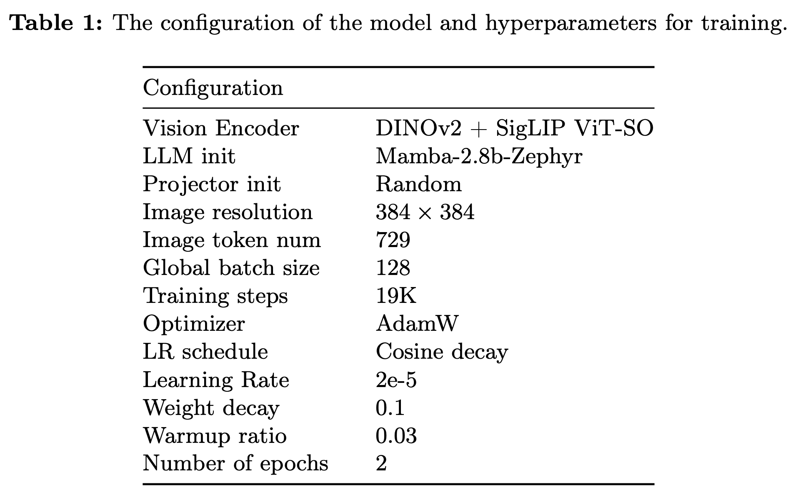

  - SigLIP ViT-SO: Shape-Optimized version의 SigLiP ViT

  - LLM

    - pretrained: SlimPajama dataset (627B token)

    - fintuned: Ultrachat-200k dataset + Ultrafeedback-binarized dataset

      $\to$ 우리의 task에 맞는 initial weight로 intialize 필요!

  - LLaVA와 다르게 2 epoch로 학습 (LLaVa finetuning은 1 epoch)

    - A100 80GB x 8대로 26.5h 학습

# 4. Experiments

- 성능

  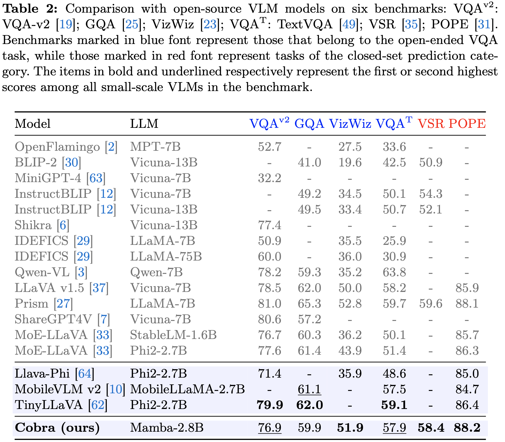

  - 동일 크기 Transformer구조 LLM보다는 성능 우위. 약 2배 큰 LLaVa v1.5-7B와는 준하는 성능

- 속도

  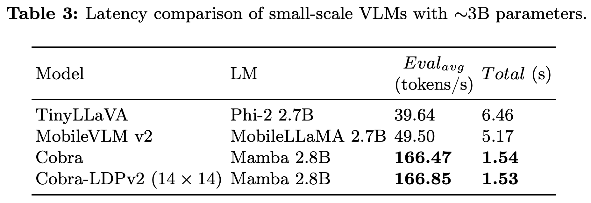

  - 동일 크기 Transformer 구조보다 약 4배 빠름 $\to$ visual token갯수가 더 많아졌음 (576 vs. 729) 에도 빨라진 것은, SSMs 구조 특성상 query 갯수의 linear하게 computation이 증가하기 때문
  - A100 PCIe 80GB GPU에서 측정한 결과
  - Visual token 갯수를 256으로 줄인 버전 (Cobra-LDPv2)와 속도 차이가 크지 않음 $\to$ SMMs 구조가 병렬 처리되는 RNN model과 동일하므로, prompt token의 갯수가 초기 forward process만 속도에 영향을 미치기 때문으로 사료됨
  - Memory usage: Transformer 구조 특성상 KV Cache만큼 memory 요구하는데 비해, SSMs은 constant-sized hidden state만 유지하므로 prompt token 갯수와 무관함 $\to$ 더 큰 dimension의 projector로 차용 가능할 듯

- Ablation studies

  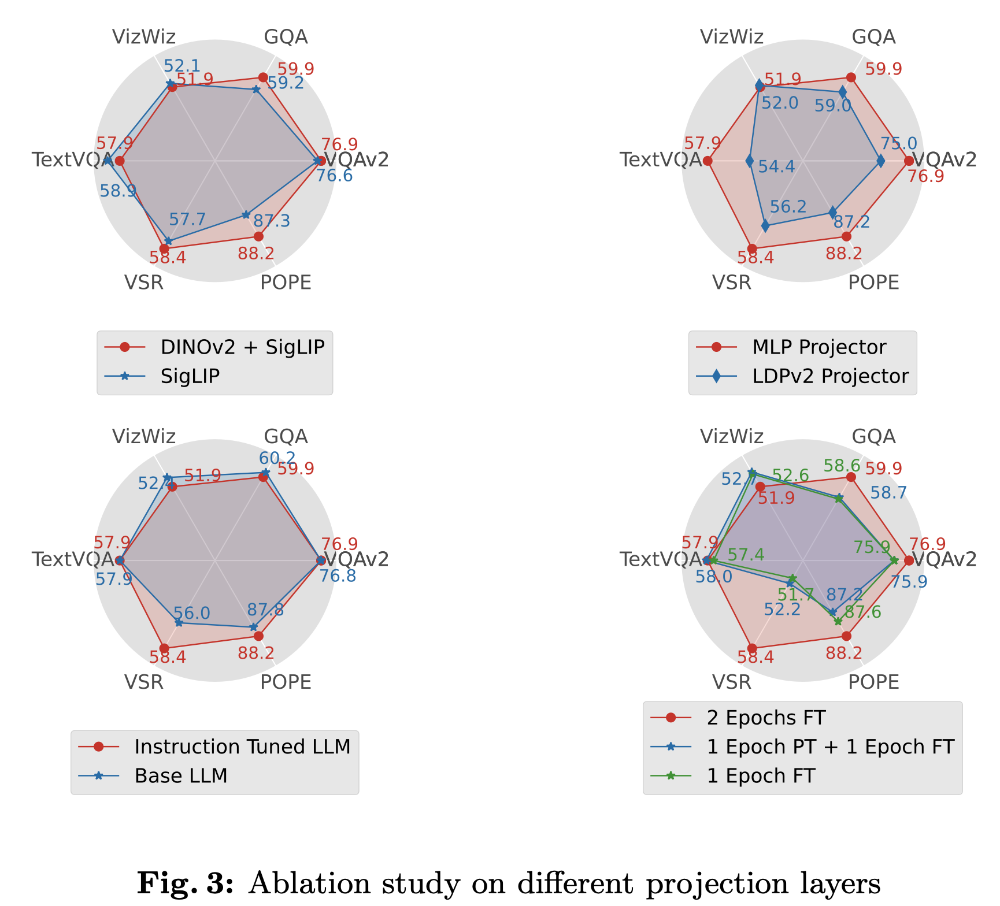

  - Visual Encoder
    - SigLIP만 쓴것보다 SigLIP+DINO-v2를 사용한게 대체로 우수
      - 단, semantic meaning을 강조하는 VQA tasks (VIZWIZ, TaskVQA)는 미세하게 악영향을 주는것을 볼 수 있음 $\to$ downstream task에 따라 vision encoder 결정 필요
  - Projector
    - MLP vs. LDPv2 projector
      - LDPv2처럼 token을 줄이면 (compress) 성능이 매우 안좋아짐 
  - Language Model
    - No finetuned LLM (Base LLM) vs. Instruction Tuned LLM: 엎치락 뒤치락.. 큰 영향 없음
  - Training Strategies
    - Pretraining stage 중요성: 없음 (Blue vs. Greed)
    - Epoch의 중요성: 엎치락 뒤치락.. (dataset마다 다름)

- Case study

  - Spatial Relation

    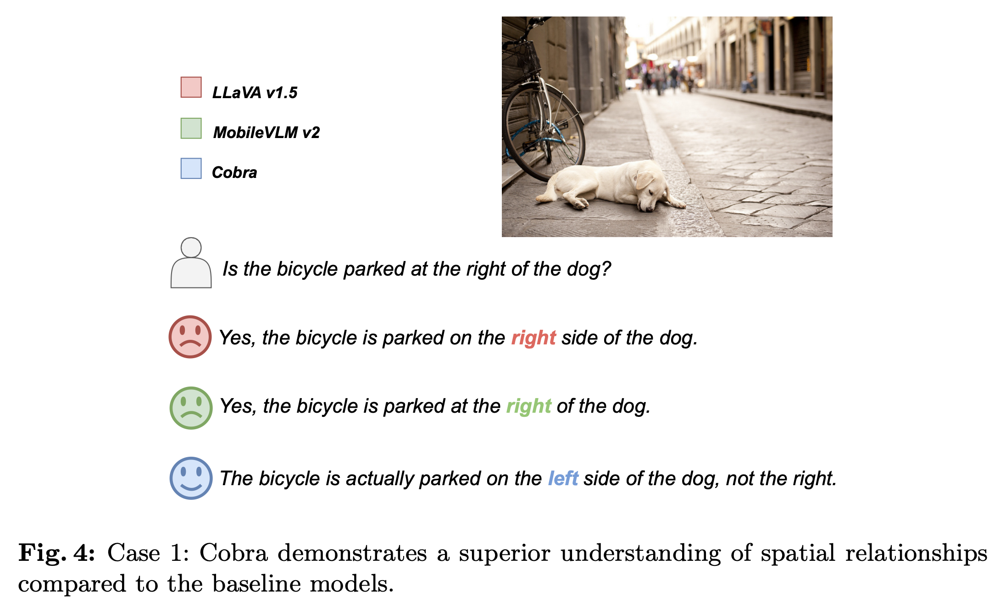

  - Compute-Generated Graphic을 잘 묘사

    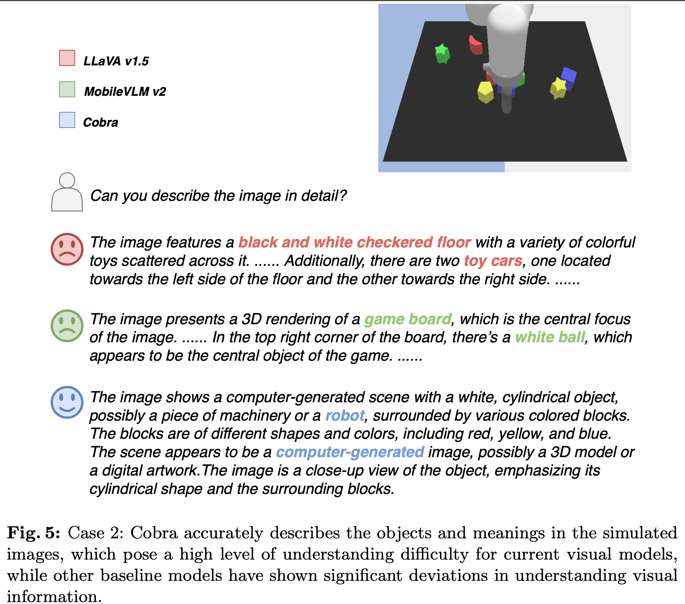

- Limitations

  - Pretrained dataset이 Tranformer 기반보다 부족함
  - Numerical precision에 민감하여, fp16이하로 quantized할 수 없음