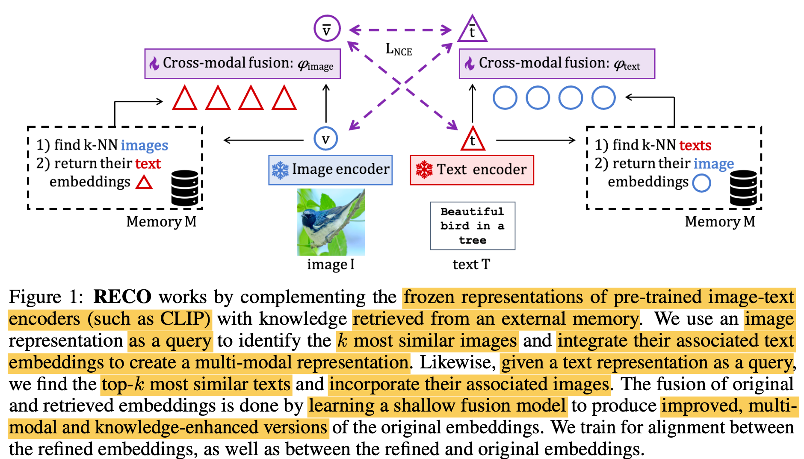

# [Retrieval] RECO: RETRIEVAL-ENHANCED CONTRASTIVE VISION-TEXT MODELS

- paper: https://arxiv.org/pdf/2306.07196
- github: X
- ICLR 2024 accepted (인용수: 23회, '25-02-13 기준)
- downstream task: (Fine-grained) Classification, T2I, I2T Retrieval

# 1. Motivation

- CLIP과 같이 대용량의 Web-crawled dataset을 기반 contrastive learning으로 학습한 Vision Language Model의 경우 "fine-grained entities"를 인식하는데 어려움이 있다.

  - Fine-grained entities: "Yello bellied flycatcher"
  - Coarse entities: "Bird"

- Model의 parameter에 Fine-grained한 정보를 주입하여 암기하게 하지 말고, 외부 정보를 활용 (Retrieval-Augmented)하는 방법을 사용해보자.

  $\to$ Frozen CLIP 모델과 external memory를 활용하여 "fine-grained"한 정보를 검색하는 대안책을 제시한다.

# 2. Contribution

- Image와 Text representation간의 정렬을 enhance하는 **r**etrieval-**e**nhanced **co**ntrastive (RECO) 방식을 제안함.

  - Light-weight, single transformer layer를 활용해 기존 representation embedding을 retireved information으로 enhance시킴

  - 가설을 실험적으로 검증하고,  **uni-modal retrieval / cross-modal fusion** 방식 도입.

    - 가설1. 다른 modality간에 alignment보다, 같은 modality간의 alignment가 잘 된다.
    - 가설2. 다른 modality간의 fusion (cross-attention)하는 것이 상호보완적인 정보를 추출하는데 유리하다.

    

- Frozen-CLIP의 성능을 여러 fine-grained benchmark에서 향상시킴

  - Stanford Cars: +10.9
  - CUB-2011: +10.2
  - OVEN: +7.3

# 3. RECO

- Overview

  

  - $\bar{v}$: RECO를 이용해 enhanced된 visual representation
  - $\bar{t}$: RECO를 이용해 enhanced된 textual representation
  - $v$: original visual representation
  - $t$: original textual representation
  - $\phi_{text}$: text fusion module
  - $\phi_{image}$: visual fusion module
  - $M$: Database
  - Image/Text encoder: text/image가 aligned된 모델. 본 논문은 CLIP 활용

  

  ## 3.1 Retrieving Cross-Modal External Knowledge

  - Memory

    - 매우 크고 다양한 concept을 cover하고 있다고 가정 (데이터가 클수록 성능이 좋아짐)

      

  - 

# 4. Experiments